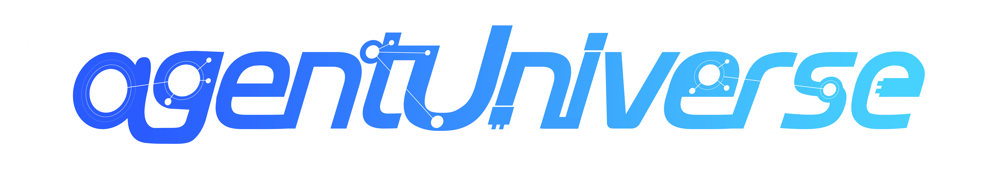
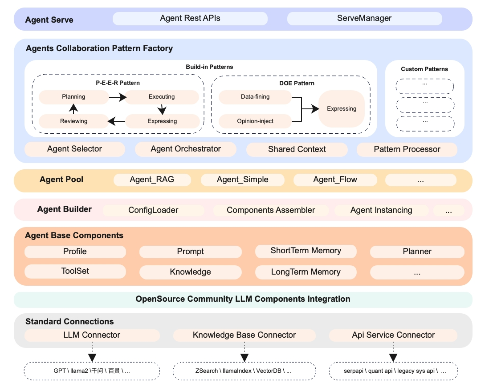

# agentUniverse
****************************************
Language version: [English](./README.md) | [中文](./README_zh.md) | [日本語](./README_jp.md)


[](LICENSE)
[](https://pypi.org/project/agentUniverse/)


****************************************

## Overview
agentUniverse is a framework for developing applications powered by multi-agent base on large language model.  It provides all the essential components for building a single agent, and a multi-agent collaboration mechanism which  serves as a pattern factory that allowing developers to buid and customize multi-agent collaboration patterns. With this framework,  developers can easily construct multi-agent applications, and share the pattern practices from different technical  and business fields.

The framework will come with serveral pre-install multi-agent collaboration patterns which have been proven effective in real business scenarios, and will continue to be enriched in the future. Patterns that are currently about to be released include:

- PEER pattern：
This pattern utilizes four distinct agent roles: Plan, Execute, Express, and Review, to achieve a multi-step breakdown and sequential execution of a complex task. It also performs autonomous iteration based on evaluative feedback which enhancing performance in reasoning and analytical tasks. 


- DOE pattern：
This pattern consists of three agents: Data-fining agent, which is designed to solve data-intensive and high-computational-precision task; Opinion-inject agent, which combines the data results from first agent and the expert opinions which are pre-collected and structured; the third agent, Express agent generates the final result base on given document type and language style.

More patterns are coming soon...



## agentUniverseSample Project
[agentUniverse Sample Project](sample_standard_app/README.md)

## Quick Installation
Using pip:
```shell
pip install agentUniverse
```

## Quick Start
We will show you how to:
* Prepare the environment and application project
* Build a simple agent
* Use pattern components to complete multi-agent collaboration
* Test and optimize the performance of the agent
* Quickly serve the agent
For details, please read [Quick Start](docs/guidebook/en/1_3_Quick_Start.md).

## Use Cases
[Legal Consultation Agent](./docs/guidebook/en/7_1_1_Legal_Consultation_Case.md)
[Python Code Generation and Execution Agent](./docs/guidebook/en/7_1_1_Python_Auto_Runner.md)
[Discussion Group Based on Multi-Turn Multi-Agent Mode](./docs/guidebook/en/6_2_1_Discussion_Group.md)

## Guidebook
For more detailed information, please refer to the [Guidebook](docs/guidebook/en/0_index.md).

## API Reference
[readthedocs](https://agentuniverse.readthedocs.io/en/latest/)

## More Ways to Contact Us
* github: https://github.com/alipay/agentUniverse
* gitee: https://gitee.com/agentUniverse/agentUniverse
* gitcode: https://gitcode.com/agentUniverse
* Stack Overflow: https://stackoverflowteams.com/c/agentuniverse/questions
* Discord: https://discord.gg/VfhEvJzQ
* WeChat Official Account: agentUniverse智多星
* DingTalk Group:

