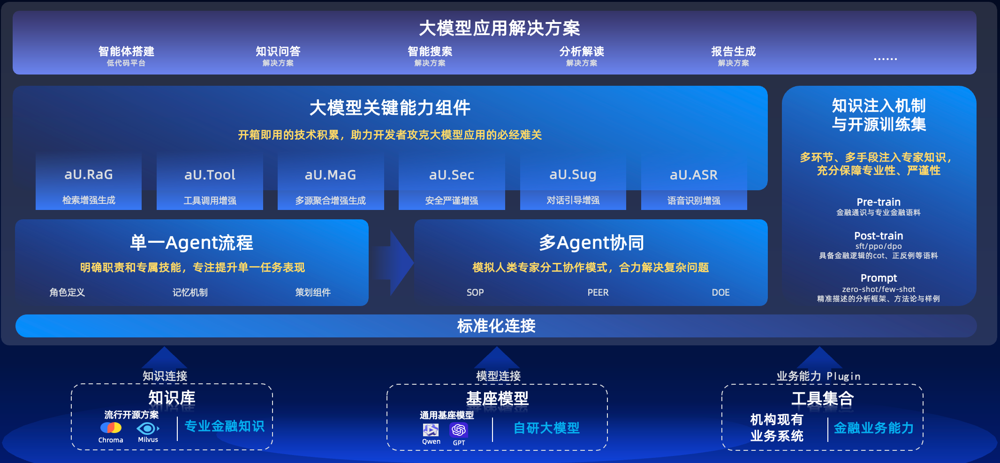

# agentUniverse
****************************************
Language version: [English](./README.md) | [中文](./README_zh.md) | [日本語](./README_jp.md)


[](LICENSE)
[](https://pypi.org/project/agentUniverse/)


****************************************

## What is agentUniverse?

**agentUniverse is a multi-agent framework based on large language models.** agentUniverse provides you with the flexible and easily extensible capability to build single agents. At its core, agentUniverse features a rich set of multi-agent collaboration mode components (which can be viewed as a Collaboration Mode Factory, or Pattern Factory). These components allow agents to maximize their effectiveness by specializing in different domains to solve problems. agentUniverse also focuses on the integration of domain expertise, helping you seamlessly incorporate domain knowledge into the work of your agents.🎉🎉🎉

**🌈🌈🌈agentUniverse helps developers and enterprises to easily build powerful collaborative agents that perform at an expert level in their respective domains.**


We encourage you to practice and share different domain Patterns within the community. The framework comes pre-loaded with several multi-agent collaboration mode components that have been validated in real-world industries and will continue to expand in the future. The components that will be available soon include:

* PEER Mode Component: This pattern uses agents with different responsibilities—Plan, Execute, Express, and Review—to break down complex problems into manageable steps, execute the steps in sequence, and iteratively improve based on feedback, enhancing the performance of reasoning and analysis tasks. Typical use cases: Event interpretation, industry analysis.
* DOE Mode Component: This pattern employs three agents—Data-fining, Opinion-inject, and Express—to improve the effectiveness of tasks that are data-intensive, require high computational precision, and incorporate expert opinions. Typical use cases: Financial report generation.

More patterns are coming soon...

****************************************

## Citation

The agentUniverse project is supported by the following research achievements.

BibTeX formatted
```text
@misc{wang2024peerexpertizingdomainspecifictasks,
      title={PEER: Expertizing Domain-Specific Tasks with a Multi-Agent Framework and Tuning Methods}, 
      author={Yiying Wang and Xiaojing Li and Binzhu Wang and Yueyang Zhou and Han Ji and Hong Chen and Jinshi Zhang and Fei Yu and Zewei Zhao and Song Jin and Renji Gong and Wanqing Xu},
      year={2024},
      eprint={2407.06985},
      archivePrefix={arXiv},
      primaryClass={cs.AI},
      url={https://arxiv.org/abs/2407.06985}, 
}
```
Overview: This document provides a detailed introduction to the mechanisms and principles of the PEER multi-agent framework. In the experimental section, scores were assigned across seven dimensions: completeness, relevance, conciseness, factualness, logicality, structure, and comprehensiveness (each dimension has a maximum score of 5 points). The PEER model scored higher on average in each evaluation dimension compared to BabyAGI and demonstrated significant advantages in the dimensions of completeness, relevance, logicality, structure, and comprehensiveness. Additionally, the PEER model achieved a superior rate of 83% over BabyAGI using the GPT-3.5 Turbo (16k) model, and 81% using the GPT-4 model. For more details, please refer to the document.
🔗https://arxiv.org/pdf/2407.06985

****************************************

## Table of Contents

* [Quick Start](#Quick-Start)  
* [How to build an agent application](#How-to-build-an-agent-application)
* [Setup the visual agentic workflow platform](#Setup-the-visual-agentic-workflow-platform)
* [Why use agentUniverse](#Why-use-agentUniverse)  
* [Sample Projects](#Sample-Projects)  
* [Documents](#Documents)  
* [Support](#Support)

****************************************
## Quick Start

### Installation
Using pip:
```shell
pip install agentUniverse
```
### Run the first example
Run your first example, and you can quickly experience the performance of the agents (or agent groups) built by agentUniverse through the tutorial.

Please refer to the document for detail steps: [Run the first example](docs/guidebook/en/Get_Start/Quick_Start.md) 。

****************************************

## How to build an agent application

### Standard Project Scaffolding
setup the standard project: [agentUniverse Standard Project](sample_standard_app)

### Create and use agents
You can learn about the important components of agents through the [Introduction to Agents](docs/guidebook/en/In-Depth_Guides/Tutorials/Agent/Agent.md). For detailed information on creating agents, refer to [Creating and Using Agents](docs/guidebook/en/In-Depth_Guides/Tutorials/Agent/Agent_Create_And_Use.md). You can also deepen your understanding of the creation and usage of agents by exploring official examples, such as the [Python Code Generation and Execution Agent](docs/guidebook/en/Examples/Python_Auto_Runner.md).

### Setting and use knowledgeBase
In the construction of intelligent agent applications, knowledge base construction and recall are indispensable. The agentUniverse framework, based on RAG technology, provides an efficient standard operating procedure for knowledge base construction and the retrieval and recall process of RAG. You can learn about its usage through the [Knowledge Introduction](docs/guidebook/en/In-Depth_Guides/Tutorials/Knowledge/Knowledge.md) and [Knowledge Definition and Usage](docs/guidebook/en/In-Depth_Guides/Tutorials/Knowledge/Knowledge_Define_And_Use.md), and further master how to quickly build a knowledge base and create a recall-capable agent through [How to Build RAG Agents](docs/guidebook/en/How-to/How_To_Build_A_RAG_Agent.md).

### Create and use Tools
In the construction of agent applications, agents need to connect to a variety of tools. You should specify a range of tools that they can use. You can integrate various proprietary APIs and services as tool plugins through [Tool Creation and Usage](docs/guidebook/en/In-Depth_Guides/Tutorials/Tool/Tool_Create_And_Use.md). The framework has already integrated LangChain and some third-party toolkits. For detailed usage, you can refer to [Integrating LangChain Tools](docs/guidebook/en/In-Depth_Guides/Components/Tools/Integrated_LangChain_Tools.md) and [Existing Integrated Tools](docs/guidebook/en/In-Depth_Guides/Components/Tools/Integrated_Tools.md).

### Effectiveness evaluation
The effectiveness evaluation of agents can be conducted through expert assessments on one hand and by leveraging the evaluation capabilities of the agents on the other. agentUniverse has launched DataAgent (Minimum Viable Product version), which aims to empower your agents with self-evaluation and evolution capabilities using agent intelligence. You can also customize the evaluation criteria within it. For more details, see the documentation: [DataAgent - Autonomous Data Agents](docs/guidebook/en/In-Depth_Guides/Tutorials/Data_Autonomous_Agent.md).

### agentServe
agentUniverse offers multiple standard web server capabilities, as well as standard HTTP and RPC protocols. You can further explore the documentation on [Service Registration and Usage](docs/guidebook/en/In-Depth_Guides/Tech_Capabilities/Service/Service_Registration_and_Usage.md) and the [Web Server](docs/guidebook/en/In-Depth_Guides/Tech_Capabilities/Service/Web_Server.md) sections.

****************************************

## Setup the visual agentic workflow platform

agentUniverse provides a visual canvas platform for agentic workflow . Please follow the steps below for a quick start:

**Install via pip**
```shell
pip install magent-ui ruamel.yaml
```

**One-click Run**

Run the [product_application.py](sample_standard_app/app/bootstrap/product_application.py) file located in sample_standard_app/app/bootstrap for a one-click start.

For more details, refer to [Quick Start for Product Platform](docs/guidebook/en/How-to/Product_Platform_Quick_Start.md) and the [Advanced Guide](docs/guidebook/en/How-to/Product_Platform_Advancement_Guide.md).

This feature is jointly launched by [difizen](https://github.com/difizen/magent) and agentUniverse.

****************************************

## Why use agentUniverse

### Concept


The core of agentUniverse provides all the key components needed to build a single intelligent agent, the collaboration mechanisms between multiple agents, and the injection of expert knowledge, enabling developers to easily create intelligent applications equipped with professional KnowHow.

### Multi Agent Collaboration
agentUniverse offers several multi-agent collaboration model components that have been validated in real industries, among which "PEER" is one of the most distinctive models.

The PEER model utilizes agents with four different responsibilities: Planning, Executing, Expressing, and Reviewing. This structure allows for the decomposition and step-by-step execution of complex problems, and enables autonomous iteration based on evaluation feedback, ultimately enhancing performance in reasoning and analytical tasks. This model is particularly effective in scenarios that require multi-step decomposition and in-depth analysis, such as event interpretation, macroeconomic analysis, and the feasibility analysis of business proposals.

The PEER model has achieved exciting results, and the latest research findings and experimental results can be found in the following literature.

### Key Features
Based on the above introduction, we summarize that agentUniverse includes the following main features:

Flexible and Extensible Agent Construction Capability: It provides all the essential components necessary for building agents, all of which support customization to enhance user-specific agents.

Rich and Effective Multi-Agent Collaboration Models: It offers collaborative models such as PEER (Plan/Execute/Express/Review) and DOE (Data-finding/Opinion-inject/Express), which have been validated in the industry. Users can also customize and orchestrate new models to enable organic collaboration among multiple agents.

Easy Integration of Domain Expertise: It offers capabilities for domain prompts, knowledge construction, and management, supporting the orchestration and injection of domain-level SOPs, aligning agents with expert-level domain knowledge.

💡 For more features, see the [key features of agentUniverse](docs/guidebook/en/Concepts/Core_Features.md) section.

****************************************

## Sample Projects

🚩 [Legal Consultation Agent v2](docs/guidebook/en/Examples/Legal_Advice.md)

🚩 [Python Code Generation and Execution Agent](docs/guidebook/en/Examples/Python_Auto_Runner.md)

🚩 [Discussion Group Based on Multi-Turn Multi-Agent Mode](docs/guidebook/en/Examples/Discussion_Group.md)

🚩 [Financial Event Analysis Based on PEER Multi-Agent Mode](docs/guidebook/en/Examples/Financial_Event_Analysis.md)

🚩 [Andrew Ng's Reflexive Workflow Translation Agent Replication](docs/guidebook/en/Examples/Translation_Assistant.md)

****************************************

## Commercial Product base on agentUniverse

🔗 [_Zhi Xiao Zhu_-AI Assistant for Financial Professionals](https://zhu.alipay.com/?from=au)

**_Zhi Xiao Zhu_ AI Assistant: Facilitate the implementation of large models in rigorous industries to enhance the efficiency of investment research experts**

_Zhi Xiao Zhu_ AI Assistant is an efficient solution for the practical application of large models in rigorous industries. It is based on the Finix model, which focuses on precise applications, and the agentUniverse intelligent agent framework, which excels in professional customization. This solution targets a range of professional AI business assistants related to investment research, ESG (Environmental, Social, and Governance), finance, earnings reports, and other specialized areas. It has been extensively validated in large-scale scenarios at Ant Group, enhancing expert efficiency.

https://private-user-images.githubusercontent.com/39180831/355437700-192f712d-1b03-46a6-8422-1ca10aa94331.mp4?jwt=eyJhbGciOiJIUzI1NiIsInR5cCI6IkpXVCJ9.eyJpc3MiOiJnaXRodWIuY29tIiwiYXVkIjoicmF3LmdpdGh1YnVzZXJjb250ZW50LmNvbSIsImtleSI6ImtleTUiLCJleHAiOjE3MjI5NDk4NTAsIm5iZiI6MTcyMjk0OTU1MCwicGF0aCI6Ii8zOTE4MDgzMS8zNTU0Mzc3MDAtMTkyZjcxMmQtMWIwMy00NmE2LTg0MjItMWNhMTBhYTk0MzMxLm1wND9YLUFtei1BbGdvcml0aG09QVdTNC1ITUFDLVNIQTI1NiZYLUFtei1DcmVkZW50aWFsPUFLSUFWQ09EWUxTQTUzUFFLNFpBJTJGMjAyNDA4MDYlMkZ1cy1lYXN0LTElMkZzMyUyRmF3czRfcmVxdWVzdCZYLUFtei1EYXRlPTIwMjQwODA2VDEzMDU1MFomWC1BbXotRXhwaXJlcz0zMDAmWC1BbXotU2lnbmF0dXJlPTU4NWMzNzVjOGZjZDNjMDMzMTE4YjQzOTk0ZWQwZGZkNWNmNWQxNWMzYWIzMTk4MzY1MjA5NWRhMjU2NGNiNzUmWC1BbXotU2lnbmVkSGVhZGVycz1ob3N0JmFjdG9yX2lkPTAma2V5X2lkPTAmcmVwb19pZD0wIn0.q1vdSg_Ghxr-DHLXfmQ_fVVRVSFn7H8VMHMi-_2QrjA

****************************************

## Documents

### User Guide
💡 For more detailed information, please read the [User Guide](./docs/guidebook/en/Contents.md).

### API Reference
💡 Please read the [API Reference](https://agentuniverse.readthedocs.io/en/latest/).

****************************************

## Support

### Submit Questions via GitHub Issues
😊 We recommend submitting your queries using [GitHub Issues](https://github.com/antgroup/agentUniverse/issues), we typically respond within 2 days.

### Contact Us via Discord
😊 Join our [Discord Channel](https://discord.gg/DHFcdkWAhn) to interact with us.

### Contact Us via Administrator Email
😊 Email: 
* [jihan.hanji@antgroup.com](mailto:jihan.hanji@antgroup.com)
* [jerry.zzw@antgroup.com](mailto:jerry.zzw@antgroup.com)
* [jinshi.zjs@antgroup.com](mailto:jinshi.zjs@antgroup.com)

### twitter
ID: [@agentuniverse_](https://x.com/agentuniverse_)

### Acknowledgements

This project is partially built on excellent open-source projects such as langchain, pydantic, gunicorn, flask, SQLAlchemy, chromadb, etc. (The detailed dependency list can be found in pyproject.toml). We would like to extend special thanks to the related projects and contributors. 🙏🙏🙏
