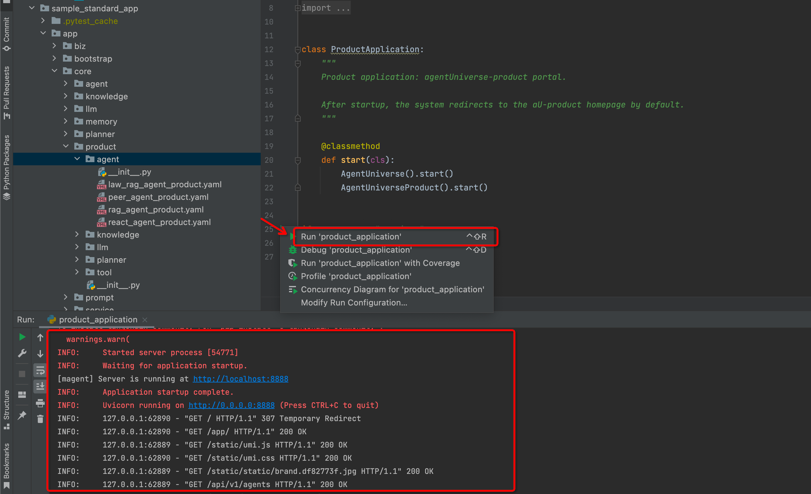
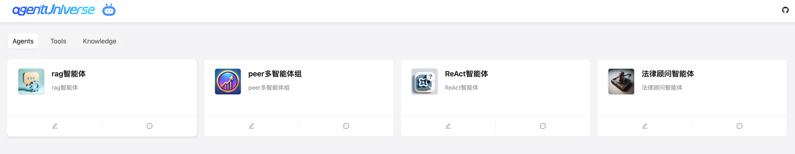
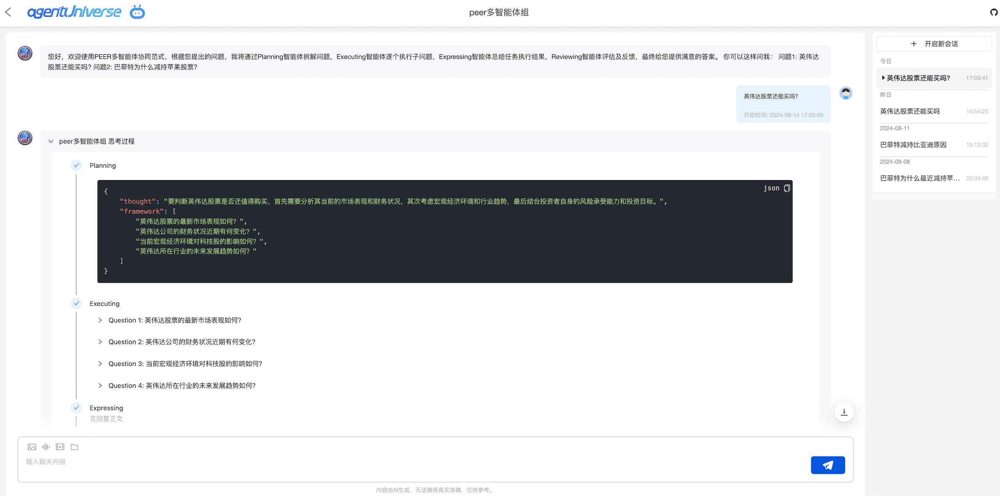
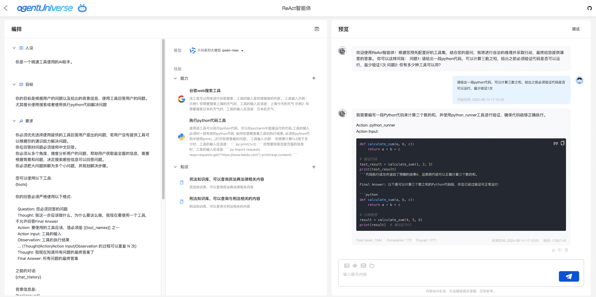
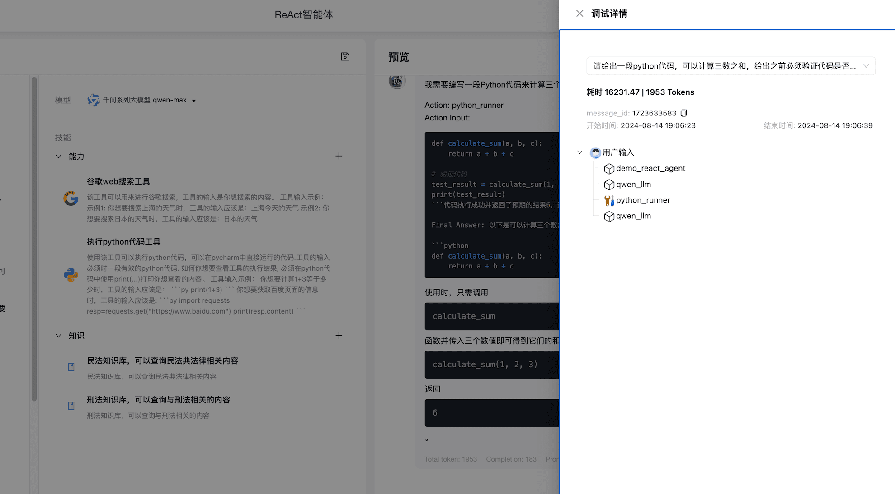

# Product Platform Quick Start
In this section, we will show you how to:

* Start the agentUniverse productized service
* Configure the agentUniverse product modules
* Quickly get started with productized features
* Debug and experience agents online, optimizing agent performance

## Environment and Application Engineering Preparation
### Application Engineering Preparation
We have placed the **product module samples** in the agentUniverse’s sample_standard_app project. You can view them [here](../../../sample_standard_app/app/core/product). This part can be configured in the background through YAML, and of course, these functions can be automatically created and managed through the product page.

### Installing Dependencies
**Using pip**
```shell
pip install magent-ui ruamel.yaml
```

### Configuration File
If you have previously used aU’s sample project, please add the following information to the `config.toml` file configuration to include the product module path, as configured in sample_standard_app:
```toml
# Ignore the context content.
[CORE_PACKAGE]
# Scan and register product components for all paths under this list, with priority over the default.
product = ['sample_standard_app.app.core.product']
# Ignore the context content.
```
If you are using aU for the first time, you can directly use the latest sample project’s `config.toml`.

#### Private Configuration File
Of course, when using the agent, you need to pre-configure the various LLM model keys/Tool keys, otherwise, the overall process of the agent cannot be connected. This part is currently not provided in the product page configuration management. Please reuse aU’s original key configuration method. In future versions, we will directly provide key management capabilities for each model in the product.


## Using the agentUniverse Product Platform
### Starting the Product Service
Run the [product_application](../../../sample_standard_app/app/bootstrap/product_application.py) file located in `sample_standard_app/app/bootstrap` to start with one click.



After a successful start, it will automatically redirect to the product homepage, which includes system presets and your custom Agent/Tool/Knowledge product modules.


### Experience the Agent
As shown in the image above, click the chat button on the right of the peer multi-agent group to enter the conversation page.

The conversation management system includes the last 10 agent conversation history records, allowing you to directly engage in multi-turn dialogues and experience the capabilities of the peer multi-agent group (default is streaming dialogue, and the multi-agent group includes the intermediate thinking process).


### Debugging the Agent
On the product homepage, click the edit button on the left of the agent to enter the online debugging page.

You can debug the agent’s Prompt/Tool/Knowledge/LLM online. Click the save button, and aU-product will automatically save the configuration to the corresponding yaml file.


Click the debug button in the upper right corner of the image above to view the Trace information, including token consumption, call chain, and latency of the agent’s specific invocation process.


## Configuring agentUniverse Product Modules
### Creating Product Modules
```yaml
id: demo_rag_agent
nickname: rag智能体
type: AGENT
opening_speech: |
  欢迎使用rag chatbot！根据您的提问，我将结合实时信息及我个人掌握的知识，给您提供合理的解答。
  你可以这样问我：
  问题1: 巴黎奥运会中国获得了几块奖牌
  问题2: 巴菲特为什么减持苹果股票
avatar: ../../../resources/rag_agent_logo.png
metadata:
  class: AgentProduct
  module: agentuniverse_product.base.agent_product
  type: PRODUCT
```

As shown in the yaml file above:

- `product id` corresponds to `name` in the agent yaml
- `type` corresponds to `AGENT`
- `metadata` is configured as the value shown above
- Other parameters can be configured as needed (the same applies to tool/knowledge modules)

### Configuring Global Config
In the global `config.toml`, configure the package scan path corresponding to the product module. With one click, you can start the product platform and display the corresponding agent/tool/knowledge information.

## More
The agentUniverse-product platform is continuously iterating, and more convenient and useful features will be available for community users to experience in the future. We also welcome your valuable suggestions.

This feature is jointly launched by [difizen](https://github.com/difizen/magent) and agentUniverse.

Let’s explore and progress together!