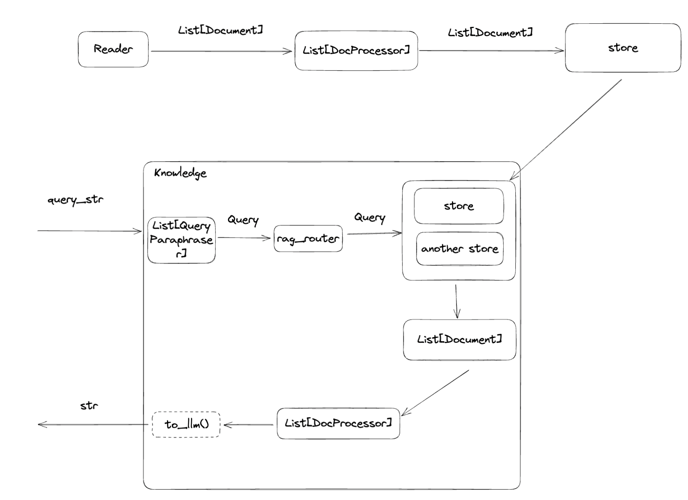

# Knowledge Related Domain Objects
In this chapter, we will discuss the structure of Knowledge within agentUniverse from an architectural perspective and list the core domain objects related to it. We will omit the corresponding code, but if you wish to delve deeper, you can refer to the source code based on the package paths provided.

In agentUniverse, the overall architecture of Knowledge and its related domain objects is illustrated in the following diagram:

The upper part of the diagram, from Reader to Store, represents the Knowledge injection process, while the lower part represents the Knowledge query process.

## Knowledge Injection Process

In the Knowledge injection process, `Reader` is used to read raw data and convert it into the `Document` format used within agentUniverse. A Document can contain various types of content such as text, images, vectors, etc., and can be extended to include more forms such as audio or video by inheriting this type. After that, the `DocProcessor` performs a series of processing operations on the `Document`. As shown in the diagram, the input and output of the `DocProcessor` are both in the form of a `Document`, meaning you can stack multiple `DocProcessors` during this process. Finally, the processed `Document` is stored in different Stores, which can be any type of data storage, including but not limited to relational databases, vector databases, and graph databases. Therefore, the same Document can be stored in different Stores in various forms, but they will share the same ID in their metadata, indicating that they originate from the same Document. This is used to avoid retrieving duplicate content during subsequent queries.

The following components are involved in this process:

### Knowledge
Package Path: `agentuniverse.agent.action.knowledge.knowledge.Knowledge`  
Documentation Link: [Knowledge](2_2_4_知识定义与使用.md)

### Reader
Package Path: `agentuniverse.agent.action.knowledge.reader.reader.Reader`  
Documentation Link: [Reader](2_2_4_Reader.md)

### DocProcessor
Package Path: `agentuniverse.agent.action.knowledge.doc_processor.doc_processor.DocProcessor`  
Documentation Link: [DocProcessor](2_2_4_DocProcessor.md)

### Store
Package Path: `agentuniverse.agent.action.knowledge.store.store.Store`  
Documentation Link: [Store](2_2_4_Store.md)

## Knowledge Query Process
When querying Knowledge, the user needs to construct a `Query`. Like `Document`, the content of a Query can also be diverse, ranging from simple strings to vectors or images——as long as the Store containing the Knowledge supports that query format. After passing the Query into the Knowledge component, similar to `DocProcessor`, the `QueryParaphraser` is used to process the Query. You can extract keywords from the original query string to query paragraphs with specific tags, or split the original query into multiple sub-queries that are easier to search, among other possibilities. After that, the RagRouter component is responsible for pairing the Query with the appropriate `Store`, generating multiple [Query, Store] query tasks. This pairing can be based on the LLM's understanding of the match between the query text and the Store descriptions, or it can be based on specific rules to select certain Stores. If resources allow, queries can even be performed on all Stores directly. The content returned from `Store` queries is still in the Document format, so we can continue to use `DocProcessor` for a series of post-processing tasks on the retrieved Documents. The difference here is that the `Query` will also be passed as a default parameter to the `DocProcessor`, allowing for processing tasks like reranking that require comparing the retrieved content with the `Query`. Finally, you can convert the retrieved Documents into a string format that is more understandable by the LLM using the default or custom to_llm method, which serves as the final output.

The following new components are involved in this process:
### QueryParaphraser
Package Path: `agentuniverse.agent.action.knowledge.reader.reader.Reader`  
Documentation Link: [QueryParaphraser](2_2_4_QueryParaphraser.md)

### RagRouter
Package Path: `agentuniverse.agent.action.knowledge.reader.reader.Reader`  
Documentation Link: [RagRouter](2_2_4_RagRouter.md)
