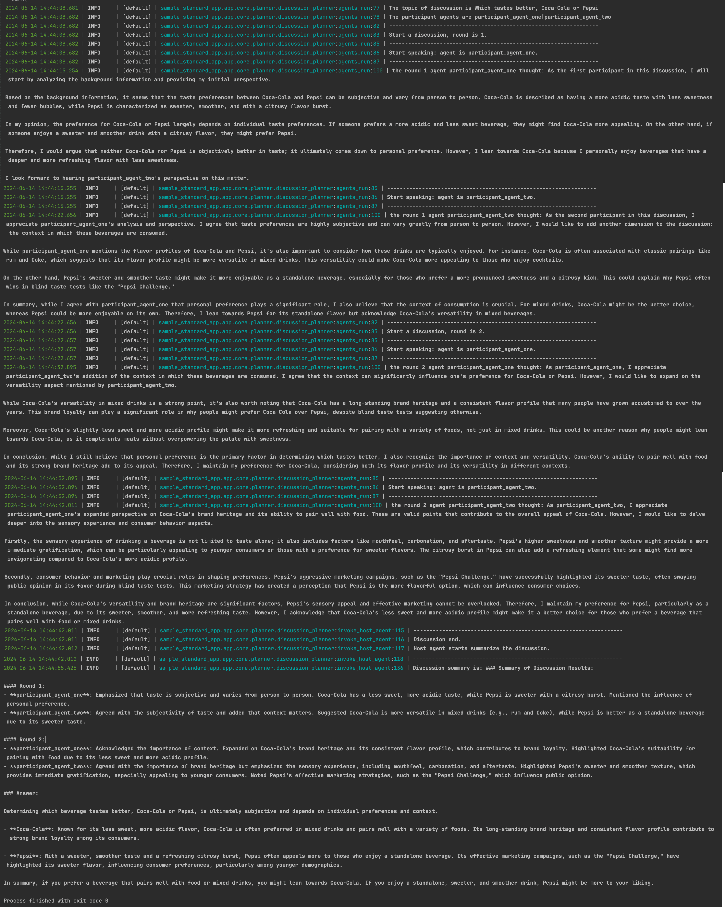

# Discussion: Multi-Agent Discussion Group
In this use case, we will demonstrate how to use agentUniverse for multi-agent discussions.

There are two agent roles: discussion group host (one) and discussion group participants (several).

The user initiates a discussion topic, and the host organizes the participants to start the discussion. In each round, each participant expresses his or her own views according to the topic of the discussion (the views of each participant are not immutable and will be constantly adjusted as the discussion goes on). After several rounds of discussion, the host will summarize the discussion process and return the results of the participants after several rounds of discussion to the user.

Many heads are better than one, imagine that you have a question you want to answer and submit it directly to the agentUniverse discussion group, The host will organize multiple agents with different ideas together, focus on your question, and finally give you a comprehensive and intelligent answer, which is an interesting agent experiment.

## Quick Start
### Configure API Key
For example, configure key information in the file `custom_ key.toml` in which agentUniverse manages private key configuration (The agentUniverse discussion group uses GPT as the base model and Serper as the Google search tool by default. The following describes how to use other models or tools).
```toml
[KEY_LIST]
# serper google search key
SERPER_API_KEY='xxx'
# openai api key
OPENAI_API_KEY='xxx'
```
### Modify Prompt Version
Modify the prompt version of agents to the english version, the discussion group multi-agent configuration file is located in the app/core/agent/discussion_agent_case directory in the `sample_standard_app` sample project. Find the host_agent.yaml and change `prompt_version` to `host_agent.en`, similarly find the participants yaml file and change the `prompt_version` to `participant_agent.en`.

```yaml
info:
  name: 'host_agent'
  description: 'host agent'
profile:
  prompt_version: host_agent.en
  llm_model:
    name: 'demo_llm'
    temperature: 0.6
plan:
  planner:
    name: 'discussion_planner'
    round: 2
    participant:
      name:
        - 'participant_agent_one'
        - 'participant_agent_two'
memory:
  name: 'demo_memory'
metadata:
  type: 'AGENT'
  module: 'sample_standard_app.app.core.agent.discussion_agent_case.host_agent'
  class: 'HostAgent'
```


### Run Discussion Group
In the sample project of agentUnvierse `sample_standard_app`, find the `discussion_chat_bots.py` file in the app/examples directory, enter the question you want to answer in the chat method, and run it.

For example, enter the question: Which tastes better, Coca-Cola or Pepsi
```python
from agentuniverse.base.agentuniverse import AgentUniverse
from agentuniverse.agent.agent import Agent
from agentuniverse.agent.agent_manager import AgentManager

AgentUniverse().start(config_path='../../config/config.toml')


def chat(question: str):
    instance: Agent = AgentManager().get_instance_obj('host_agent')
    instance.run(input=question)


if __name__ == '__main__':
    chat("Which tastes better, Coca-Cola or Pepsi")
```
### Result Demonstration
Which tastes better, Coca-Cola or Pepsi：



## More Details
### Agent Configuration
The discussion group multi-agent configuration files are located in the app/core/agent/discussion_agent_case directory in the `sample_standard_app` sample project.

The host corresponds to `host_agent.yaml` and the participant corresponds to `participant_agent_*.yaml`.


The prompt is managed by the prompt version. For example, the default prompt_version of host_agent is `host_agent.cn`, and the corresponding prompt file is `host_agent.cn.yaml` under the app/core/prompt directory.

If the LLM Model will be modified to another, such as the Qwen model, change the `llm_model` name information (such as the `qwen_llm` built into the aU system).

The number of discussion rounds in agent plan defaults to 2, which users can adjust as needed. The default participants are two agents built into aU, which can add discussion group members by creating new agents and configuring the agent name parameter to the `participant` of the planner.

```yaml
info:
  name: 'host_agent'
  description: 'host agent'
profile:
  prompt_version: host_agent.cn
  llm_model:
    name: 'qwen_llm'
    temperature: 0.6
plan:
  planner:
    name: 'discussion_planner'
    round: 2
    participant:
      name:
        - 'participant_agent_one'
        - 'participant_agent_two'
memory:
  name: 'demo_memory'
metadata:
  type: 'AGENT'
  module: 'sample_standard_app.app.core.agent.discussion_agent_case.host_agent'
  class: 'HostAgent'
```

### Memory Configuration
Participants in the aU discussion group configure `demo_memory` in the `sample_standard_app` sample project by default to store common memory information for the entire discussion group.

### Planner Configuration
The planner configuration file is located in the app/core/planner directory of the `sample_standard_app` sample project, where the `discussion_planner.py` file is the specific plan process code of the discussion group. If you are interested, you can read it yourself.

### Prompt Configuration
The prompt is managed by the prompt version, and the default prompt files of the aU discussion group agent are configured in the app/core/prompt directory. Corresponding to the Chinese and English versions (host_agent_xx.yaml/participant_agent_xx.yaml), users can change the prompt_version in the agent configuration to complete fast switching.

### Tool Configuration
Two participants in the aU discussion group are configured with google_search_tool by default. Users can change the `tool name` in the `participant_agent_xxx.yaml` under the app/core/agent/discussion_agent_case directory in the `sample_standard_app` sample project to switch tool calls.
