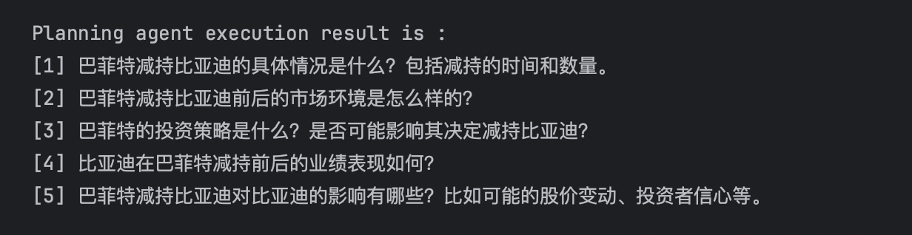
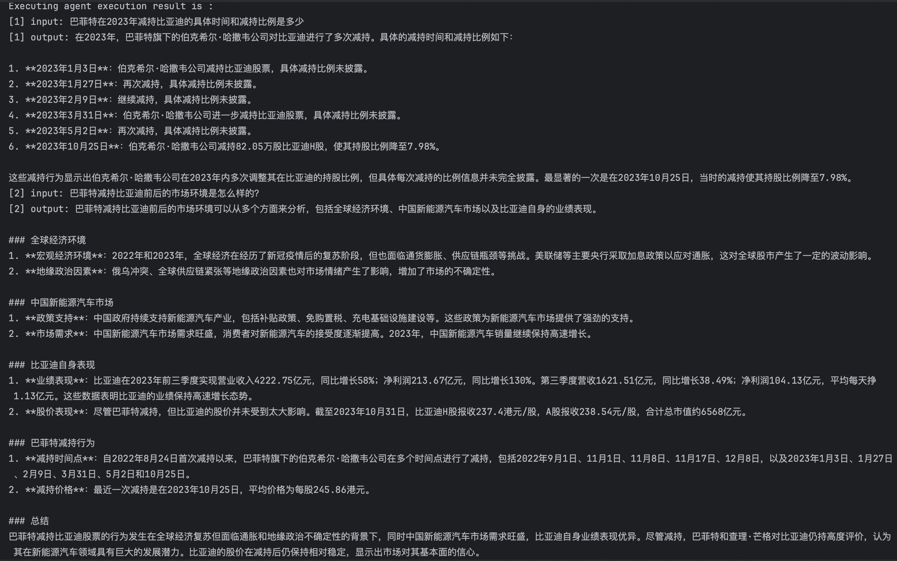
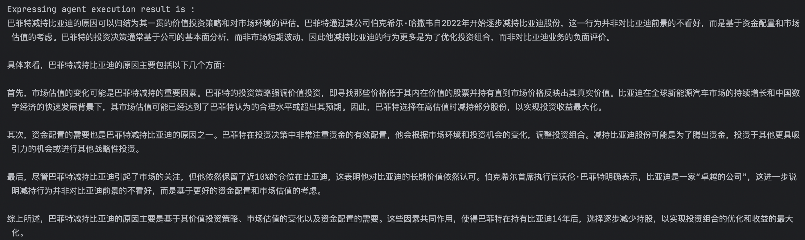
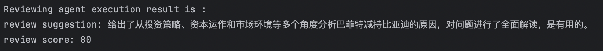

# Financial Event Analysis Case
## Case Description
This case is based on PeerPlanner and showcases a multi-agent collaborative example for analyzing financial events. Regarding the topic of "Buffett's 2023 Reduction in BYD Shares"， it demonstrates how to use the PEER multi-agent collaboration model in agentUniverse and details the configuration and output examples for each agent in PEER.

This case study utilizes the GPT-4o model by OPENAI. Before using it, you need to configure the `OPENAI_API_KEY` in your environment variables.

## Agents
### Planning Agent 
Reference the original code files:
- [Configuration file](../../../sample_standard_app/intelligence/agentic/agent/agent_instance/peer_agent_case/demo_planning_agent.yaml)
- [Prompt file](../../../sample_standard_app/intelligence/agentic/prompt/planning_agent_cn.yaml)  

The Planning Agent is responsible for breaking down the original financial problem into multiple sub-problems that can be individually solved and provided to the subsequent Executing Agent. In this case, the original question "Analyze the reasons for Buffett's reduction in BYD shares" can be decomposed into several sub-questions as shown in the diagram below:

You can debug the Planning Agent individually in the [test file](../../../sample_standard_app/intelligence/test/test_planning_agent.py).

### Executing Agent 
Reference the original code files:
- [Configuration file](../../../sample_standard_app/intelligence/agentic/agent/agent_instance/peer_agent_case/demo_executing_agent.yaml)
- [Prompt file](../../../sample_standard_app/intelligence/agentic/prompt/executing_agent_cn.yaml)

In this Agent, we provide a tool [google_search_tool](../../../sample_standard_app/intelligence/agentic/tool/google_search_tool.py) for searching information on Google. To use this tool, you should configure `SERPER_API_KEY` in your environment. For convenience, if `SERPER_API_KEY ` is not configured, this tool will return a pre-set query result related to this case, which you can find in the [mock_search_tool](../../../sample_standard_app/intelligence/agentic/tool/mock_search_tool.py).


The Executing Agent is responsible for solving the sub-problems broken down by the Planning Agent. In this case, the execution results of the Executing Agent are as follows:  

The result is lengthy, so only the execution results of the first two questions are shown here. You can debug the Executing Agent individually in the [test file](../../../sample_standard_app/intelligence/test/test_executing_agent.py) to obtain the complete results.

### Expressing Agent 
Reference the original code files:
- [Configuration file](../../../sample_standard_app/intelligence/agentic/agent/agent_instance/peer_agent_case/demo_expressing_agent.yaml)
- [Prompt file](../../../sample_standard_app/intelligence/agentic/prompt/expressing_agent_cn.yaml)  

The Expressing Agent is responsible for summarizing all the results output by the Executing Agent and formulating them into an answer to the original question according to the requirements in the prompt file. In this case, the output result of the Expressing Agent is as follows:

You can debug the Expressing Agent individually in the [test file](../../../sample_standard_app/intelligence/test/test_expressing_agent.py).

### Reviewing Agent 
Reference the original code files:
- [Configuration file](../../../sample_standard_app/intelligence/agentic/agent/agent_instance/peer_agent_case/demo_reviewing_agent.yaml)

The Reviewing Agent is responsible for evaluating whether the result produced by the Expressing Agent is an effective answer to the original question. In this case, the Reviewing Agent accepted the answer from the Expressing Agent:

You can debug the Reviewing Agent individually in the [test file](../../../sample_standard_app/intelligence/test/test_reviewing_agent.py).

### PEER Agent 
```yaml
info:
  name: 'demo_peer_agent'
  description: 'demo peer agent'
plan:
  planner:
    name: 'peer_planner'
    eval_threshold: 60
    retry_count: 2
    planning: 'demo_planning_agent'
    executing: 'demo_executing_agent'
    expressing: 'demo_expressing_agent'
    reviewing: 'demo_reviewing_agent'
metadata:
  type: 'AGENT'
  module: 'agentuniverse.agent.default.peer_agent.peer_agent'
  class: 'PeerAgent'
```
Users can configure the four Agents mentioned above into a complete PEER Agent through the `peer_planner` collaboration model. The configurations include:
- name: Fixed as `peer_planner`, indicating the use of the PEER multi-agent collaboration model.
- eval_threshold: The minimum score for the Reviewing Agent to accept the answer.
- retry_count: The number of retries for the PEER Agent if the Reviewing Agent does not accept the answer.
- planning：The Agent responsible for the Plan part.
- executing：The Agent responsible for the Execute part.
- expressing：The Agent responsible for the Express part.
- reviewing：The Agent responsible for the Review part.

You can run the complete case in the [example file](../../../sample_standard_app/intelligence/test/peer_chat_bot.py).

