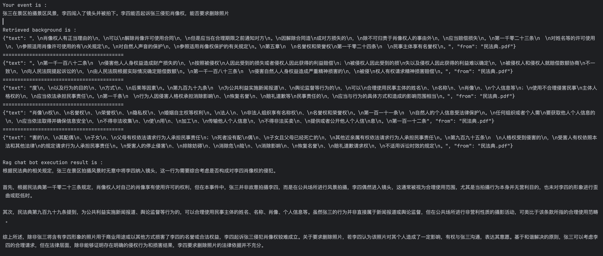

# Legal Consultation Case
## Case Description
This case is based on RagPlanner and builds a simple legal consultation agent. It provides relevant legal advice by retrieving related articles from the Civil Code and Criminal Law and combining them with the case background.

This case utilizes the Qianwen large model and the DashScope embedding feature. Before using it, you need to configure the DASHSCOPE_API_KEY in your environment variables.

## Components
### Legal Knowledge Base
The legal knowledge base is based on the [Knowledge Component ](2_2_4_知识.md) in agentUniverse. By embedding the original text of legal articles and storing them in the ChromaDB vector database, it creates a knowledge base that the agent can easily reference and retrieve.  
Original legal texts:
- [Civil Code.pdf](../../../sample_standard_app/app/resources/民法典.pdf)
- [Criminal Law.pdf](../../../sample_standard_app/app/resources/刑法.pdf)

You can refer to the following code:
- [Civil Code Knowledge Base](../../../sample_standard_app/app/core/knowledge/civil_law_knowledge.py)
- [Criminal Law Knowledge Base](../../../sample_standard_app/app/core/knowledge/criminal_law_knowledge.py)

To make it convenient for you, we have placed the database files with relevant information in [this directory](../../../sample_standard_app/DB/), If you want to build the knowledge base from scratch, you can modify the following part of the code:
```python
# Initialize the knowledge
# self.insert_knowledge()
```
Remove the comment from self.insert_knowledge() to rebuild the database.

### Law Agent
This agent involves the following two files:
- [law_rag_agent.py](../../../sample_standard_app/app/core/agent/rag_agent_case/law_rag_agent.py): Defines the agent's input and output
- [law_rag_agent.yaml](../../../sample_standard_app/app/core/agent/rag_agent_case/law_rag_agent.yaml): Defines the agent's related prompts


### Demonstration Code
[CodeLink](../../../sample_standard_app/app/examples/law_chat_bot.py)

## Demonstration
