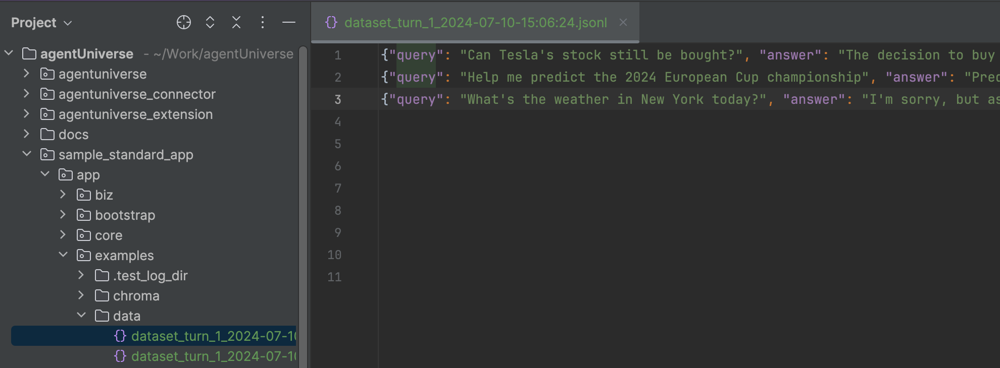
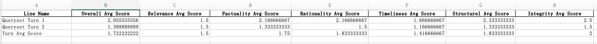

# Data Autonomous Agent
## Introduction
The comprehensive view of the Data Autonomous Agent: Through **automated batch execution of multiple rounds of agent invocation**, **offline adaptive data collection**, **production of evaluation datasets**, **production of fine-tuning datasets**, **model inference training**, and **automatic multidimensional assessment of datasets**, a complete workflow is established to enhance the data autonomy process of large language models and Agents.

The current agentUniverse has released the **Data Autonomous MVP (Minimum Viable Product) version**, which, based on the **query sets** specified by the user, performs **automated batch execution of multiple rounds of agent invocation**, **produces evaluation datasets**, **automatically assesses datasets in multiple dimensions**, and **generates evaluation reports**. It conveys the concept of data autonomy to the open-source community, and will gradually open up the complete capabilities of the data autonomous workflow in the future.

## Background
Currently, the evaluation of the performance of Agents within the industry often relies on the expertise of specialists in specific fields to conduct a significant amount of manual review and annotation, ensuring the high quality and accuracy of the assessment results.

The dataAgent hopes to use the agent's own capabilities to **self-collect**, **self-manage**, and **intelligently evaluate the data of the Agent**.

In the MVP version, you can use the `dataset_build_agent` to make multiple rounds of batch invocation on the query sets to be evaluated, producing evaluation datasets. Then, by using the `dataset_eval_agent`, you can apply the **Fin-Eva** data evaluation standards published by Ant Group based on seven dimensions (relevance, factuality, rationality, timeliness, structure, integrity, and comprehensiveness) to conduct intelligent data assessment and annotation. The results of multiple rounds of evaluation are subjected to a rich statistical analysis to provide users with a more intuitive view of the changes in the Agent's capabilities.

By utilizing a complete set of data autonomy capabilities, you can easily understand the current level of your agent through intelligently generated evaluation reports.

It needs to be particularly emphasized that the scores in the entire evaluation report are reference values. In the actual production environment, we will conduct a comprehensive comparison of scores from multiple rounds to distinguish the effectiveness of the agent.

## DataAgent Flowchart

- data_agent consists of two parts. **dataset_build_agent** is responsible for automating batch execution of multiple rounds of agent invocation and producing evaluation datasets.
- **dataset_eval_agent** is responsible for automating the multidimensional evaluation of the dataset and generating evaluation report.

## DataAgent Execution Steps
### Step1 Establish Agent Queryset
In DataAgent, you first need to construct an agent queryset in the JSONL file format, where each line represents a complete input for an agent invocation.

As shown below, establish a queryset of 3 items, where "input" corresponds to the query information for the agent:
```jsonl
{"input": "Help me predict the 2024 European Cup championship"}
{"input": "Can Tesla's stock still be bought?"}
{"input": "What's the weather in New York today?"}
```

### Step2 Configure DataAgent
Configure the DataAgent as follows, the configuration file, in addition to the basic configuration of the agent, mainly includes two important items: `dataset_builder` corresponds to the name of the agent for producing the evaluation dataset, and `dataset_evaluator` corresponds to the name of the agent for dataset evaluation and annotation.
```yaml
info:
  name: 'data_agent'
  description: 'data agent'
plan:
  planner:
    dataset_builder: 'dataset_build_agent'
    dataset_evaluator: 'dataset_eval_agent'
metadata:
  type: 'AGENT'
  module: 'sample_standard_app.app.core.agent.data_agent_case.data_agent'
  class: 'DataAgent'
```
[data_agent sample configuration file](../../../sample_standard_app/app/core/agent/data_agent_case/data_agent.yaml)

[data_agent sample python file](../../../sample_standard_app/app/core/agent/data_agent_case/data_agent.py)

### Step3 Configure the agent for producing the evaluation dataset.
Use the **dataset_build_agent** configured in step2 `dataset_builder`, and the following is the configuration file of dataset_build_agent. In addition to the basic configuration of the agent, the configuration file mainly includes two important items: `candidate` configures the name of the agent to be evaluated (for example, to evaluate the effectiveness of demo_rag_agent, candidate is configured as demo_rag_agent), and `concurrency_level` configures the level of concurrency when executing batch agent invocation (for example, setting it to 5 represents calling the candidate agent concurrently with 5).
```yaml
info:
  name: 'dataset_build_agent'
  description: 'dataset build agent'
profile:
  concurrency_level: 1
plan:
  planner:
    candidate: 'demo_rag_agent'
metadata:
  type: 'AGENT'
  module: 'sample_standard_app.app.core.agent.data_agent_case.dataset_build_agent'
  class: 'DatasetBuildAgent'
```
[dataset_build_agent sample configuration file](../../../sample_standard_app/app/core/agent/data_agent_case/dataset_build_agent.yaml)

[dataset_build_agent sample python file](../../../sample_standard_app/app/core/agent/data_agent_case/dataset_build_agent.py)

### Step4 Configure the agent for dataset evaluation and annotation
Use the **dataset_eval_agent** configured in step2 `dataset_evaluator`, and the following is the configuration file of dataset_eval_agent. In addition to the basic configuration of the agent, the configuration file mainly includes two important items: `llm_model` configures the agent model, and `max_eval_lines` configures the number of evaluation data lines (for example, setting it to 10 means only evaluate the first 10 rows of data, to avoid global evaluation and the consumption of a large number of tokens).
```yaml
info:
  name: 'dataset_eval_agent'
  description: 'dataset eval agent'
profile:
  prompt_version: dataset_eval_agent.en
  max_eval_lines: 10
  llm_model:
    name: 'demo_llm'
    model_name: 'gpt-4o'
    temperature: 0.1
metadata:
  type: 'AGENT'
  module: 'sample_standard_app.app.core.agent.data_agent_case.dataset_eval_agent'
  class: 'DatasetEvalAgent'
```
[dataset_eval_agent sample configuration file](../../../sample_standard_app/app/core/agent/data_agent_case/dataset_eval_agent.yaml)

[dataset_eval_agent sample python file](../../../sample_standard_app/app/core/agent/data_agent_case/dataset_eval_agent.py)

### step5 Run DataAgent
Through the [dataAgent code entry](../../../sample_standard_app/app/examples/data_agent.py), configure two parameters: `queryset_path` representing the path to the queryset, and `turn` representing the total number of rounds for the queryset execution, to start the dataAgent with one click.

Tips: please configure the queryset and specific evaluation rows reasonably to avoid excessive computational and token consumption.

## DataAgent Example Usage
Refer to the **DataAgent Execution Steps** mentioned above, and start the configured dataAgent through 5 steps.

### Evaluation Dataset
First, generate the evaluation dataset, storing the agent's Q&A pairs in the JSONL file format.
As shown in the figure below:
- query: agent question 
- answer: agent answer



[dataAgent sample evaluation dataset](../../../sample_standard_app/app/examples/data/dataset_turn_1_2024-07-10-15:06:24.jsonl)


### Complete Evaluation Results
After producing the evaluation dataset, dataAgent begins multidimensional data assessment and annotation, generating complete evaluation results (if multiple rounds of dataAgent batch tasks are executed, multiple complete evaluation results will be produced).

As shown in the figure below:
- Line Number: The line number of the current evaluation data within the dataset.
- Overall Score: comprehensive score = total of assessment scores from multiple dimensions / number of assessment dimensions (full score is 5, score range 0-5).
- Query: agent question.
- Answer: agent answer.
- Relevance Score: represents the relevance of the agent answer to the question, the higher the score, the more relevant (full score is 5, score range 0-5).
- Relevance Suggestion: represents issues and suggestions for improvement in the relevance dimension.
- More dimensions Score/Suggestion: similar to the Relevance dimension.


[dataAgent sample eval result](../../../sample_standard_app/app/examples/data/eval_result_turn_1_2024-07-10-15:06:24.xlsx)


### Comprehensive Evaluation Report
Generate a comprehensive evaluation report based on multiple complete evaluation results.

As shown in the figure below:
- Line Name: Includes two types, such as `Queryset Turn x` representing the evaluation dataset generated in the x-th round based on the queryset, and `Turn Avg Score` representing the average score of multiple rounds and dimensions.
- Overall Avg Score: The sum of the overall scores of all data in a single round of the dataset / the amount of data in the dataset (full score is 5, score range 0-5).
- Relevance Avg Score: The sum of the relevance scores of all data in a single round of the dataset / the amount of data in the dataset (full score is 5, score range 0-5).
- More dimensions Avg Score: similar to the Relevance dimension.


[dataAgent sample evaluation report](../../../sample_standard_app/app/examples/data/eval_report_2024-07-10-15:06:24.xlsx)

### Comparative Experiment
Adjust the llm model in demo_rag_agent within aU from the previous `qwen1.5-72b-chat` to `qwen1.5-7b-chat`, and after evaluation by dataAgent, the comprehensive evaluation reports are as follows:

The following figure is the comprehensive evaluation report produced by the data autonomous agent when the model is qwen1.5-7b-chat:


The following figure is the comprehensive evaluation report produced by the data autonomous agent when the model is qwen1.5-72b-chat:

Comparing the two comprehensive evaluation reports, it can be observed that after the agent llm model was changed from qwen1.5-7b-chat to qwen1.5-72b-chat, there was a significant increase in the scores across all dimensions in multiple rounds. This method can quickly distinguish the difference in agent effects after the agent configuration was changed.

## DataAgent Detailed Description
### data_agent
- [configuration file](../../../sample_standard_app/app/core/agent/data_agent_case/data_agent.yaml)
- [agent file](../../../sample_standard_app/app/core/agent/data_agent_case/data_agent.py)

### dataset_build_agent
- [configuration file](../../../sample_standard_app/app/core/agent/data_agent_case/dataset_build_agent.yaml)
- [agent file](../../../sample_standard_app/app/core/agent/data_agent_case/dataset_build_agent.py)
- The evaluation data produced by dataset_build_agent is stored locally in jsonl format (the jsonl file name is dataset_turn_{i}_{date}, `i` represents the round, and `date` represents the generation time)

### dataset_eval_agent
- [configuration file](../../../sample_standard_app/app/core/agent/data_agent_case/dataset_eval_agent.yaml)
- [agent file](../../../sample_standard_app/app/core/agent/data_agent_case/dataset_eval_agent.py)
- [prompt file](../../../sample_standard_app/app/core/prompt/dataset_eval_agent_en.yaml)：agentUniverse currently opens six agent evaluation dimensions that are validated in the industry (the MVP version does not open **comprehensive dimension**. The current comprehensive evaluation standard is biased towards the financial field, so it is not mentioned in the open source community)
- The **complete evaluation results** produced by dataset_eval_agent are stored locally in Excel format (the file name is eval_result_turn_{i}_{date}, `i` represents the round, and `date` represents the generation time)
- The **comprehensive evaluation report** of dataset_eval_a_agent production is stored locally in Excel format (the file name is eval_report_{date}, and date represents the generation time)