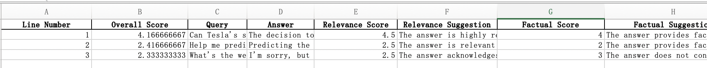
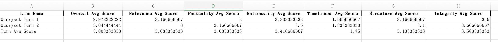

# Data Governance Agent
## Introduction
**One-sentence introduction**: agentUniverse dataAgent, through the queryset specified by users, **automates the batch execution of multiple rounds of agent calls**, and **generates the dataset**. Subsequently, it carries out **automated evaluation annotation** and **generates the evaluation report**.

Currently, agentUniverse has released **the MVP version of data governance**, conveying the concept of data governance to the open-source community. Subsequently, it will open up a complete workflow including offline adaptive data collection, fine-tuning dataset generation, model inference training, and multidimensional automatic evaluation of datasets, to strengthen the data governance process for large language models and Agents.

## DataAgent Flowchart

- data_agent consists of two parts. **dataset_build_agent** is responsible for automating batch execution of multiple rounds of agent calls and producing datasets.
- **dataset_eval_agent** is responsible for automating the multidimensional evaluation of the dataset and generating evaluation report.

## DataAgent Effect
Before elaborating on how to use dataAgent, let's first take a look at the operational effect of dataAgent.

- [dataAgent entry](../../../sample_standard_app/app/examples/data_agent.py): users build the following agent queryset, start dataAgent with one click, and produce datasets.
```jsonl
{"input": "What is the reason for the surge in Nvidia's stock?"}
{"input": "Why does Tesla stock fluctuate so much?"}
```
- [dataAgent datasets](../../../sample_standard_app/app/examples/data/dataset_turn_1_2024-07-09-11:45:42.jsonl): the production dataset is stored in the format of a JSONL file containing Q&A pairs of the agent.
```json lines
{"prompt": "Why does Tesla stock fluctuate so much?", "answer": "The question about Tesla's stock fluctuations isn't directly addressed by the provided background information on Warren Buffett's investment strategies or his dealings with BYD. However, I can provide insights based on general knowledge and market principles.\n\nTesla's stock price is known for its significant volatility, which can be attributed to several factors:\n\n1. **Market Sentiment and Speculation**: Tesla is often seen as a bellwether for the electric vehicle (EV) industry and the broader tech sector. Positive or negative news, whether related to production numbers, new model releases, regulatory changes, or CEO Elon Musk's tweets, can significantly impact investor sentiment and lead to sharp movements in the stock price.\n\n2. **Financial Performance**: Like any publicly traded company, Tesla's quarterly earnings reports can cause substantial stock price movements. If the company beats or misses analysts' expectations regarding revenue, profitability, or guidance, it can result in immediate and sometimes dramatic reactions from the market.\n\n3. **Valuation and Growth Expectations**: Tesla has been valued at very high multiples compared to traditional automakers, reflecting investors' expectations for future growth. Any indication that this growth might slow down can lead to a reevaluation of the stock's valuation, causing price drops.\n\n4. **Competition and Market Dynamics**: The EV market is rapidly evolving, with established automakers and new entrants alike increasing their focus on electric vehicles. Changes in competitive dynamics, such as new product launches or shifts in market share, can influence Tesla's stock price.\n\n5. **Regulatory Environment**: Government policies and regulations, particularly those related to EV incentives, emissions standards, and autonomous driving technology, can have a significant impact on Tesla's business outlook and stock performance.\n\n6. **Supply Chain and Production Challenges**: Tesla has faced production bottlenecks and supply chain disruptions, especially during times of global economic uncertainty. These challenges can affect the company's ability to meet production targets and deliver vehicles, impacting stock price.\n\nIn summary, Tesla's stock fluctuations are influenced by a combination of market sentiment, financial performance, high growth expectations, competitive dynamics, regulatory changes, and operational challenges. These factors contribute to the stock's characteristic volatility."}
{"prompt": "What is the reason for the surge in Nvidia's stock?", "answer": "The question about Nvidia's stock surge isn't directly related to the provided background information on Warren Buffett's investment strategies and his transactions involving BYD shares. However, I can provide a general explanation based on common factors that might cause a surge in a company's stock price.\n\nNvidia's stock price can surge due to several reasons, including but not limited to:\n\n1. **Strong Financial Performance**: If Nvidia reports better-than-expected earnings or revenue figures, this can lead to a positive market reaction, driving up its stock price. Investors often look for signs of growth and profitability when deciding where to invest their money.\n\n2. **Innovative Product Launches**: The introduction of new, cutting-edge products or technologies can also boost investor confidence and increase demand for Nvidia's stock. For instance, advancements in graphics processing units (GPUs) for gaming, artificial intelligence, and data center applications have historically been significant drivers for Nvidia.\n\n3. **Market Expansion**: If Nvidia announces plans to enter new markets or expand into existing ones, this can signal potential for increased revenue streams, which can positively impact its stock price.\n\n4. **Strategic Acquisitions**: Acquiring other companies can strengthen Nvidia's position in the market, providing access to new technologies, customer bases, or markets. Successful acquisitions can lead to a rise in stock prices as investors anticipate future growth.\n\n5. **Industry Trends**: The technology sector, particularly segments like AI, autonomous vehicles, and cloud computing, has seen significant growth in recent years. As a leader in these areas, Nvidia benefits from positive industry trends, which can contribute to higher stock prices.\n\n6. **Analyst Recommendations**: Positive recommendations from financial analysts can influence investor sentiment and lead to increased buying activity, resulting in a stock price increase.\n\n7. **Economic Conditions**: A strong economy generally leads to more consumer spending and business investments, which can benefit companies like Nvidia that sell high-end technology products.\n\nIt's important to note that while these factors can contribute to a stock price surge, individual events or market conditions can also cause volatility. Investors should consider multiple indicators and consult with financial advisors before making investment decisions."}
```
- After producing the dataset, dataAgent starts to evaluate and annotate the data in multiple dimensions, [complete evaluation results produced by dataAgent](../../../sample_standard_app/app/examples/data/eval_result_turn_1_2024-07-09-11:45:42.xlsx) (containing comprehensive scores for multidimensional evaluation of the data, specific scores for each dimension and problems discovered during the evaluation process) 

- [comprehensive evaluation report](../../../sample_standard_app/app/examples/data/eval_report_2024-07-09-11:45:42.xlsx) (including the total average scores of multiple rounds of evaluations and the total average scores of each dimension)


## DataAgent Detailed Description
### data_agent
- [configuration file](../../../sample_standard_app/app/core/agent/data_agent_case/data_agent.yaml): the configuration file mainly contains two important items: `dataset_builder` configures the agent name of the production evaluation dataset, and `dataset_evaluator` configures the agent name of the data evaluation and annotation.
- [agent file](../../../sample_standard_app/app/core/agent/data_agent_case/data_agent.py)
- The input parameter corresponding to data_agent is the queryset path, and each json data in the queryset must contain **a complete input** of an agent invocation.

### dataset_build_agent
- [configuration file](../../../sample_standard_app/app/core/agent/data_agent_case/dataset_build_agent.yaml): the configuration file mainly contains two important items,`candidate` configures the name of the agent to be evaluated (such as evaluating the demo_rag_agent effect, candidate configures demo_rag_agent), and `concurrency_level` configures the concurrency when executing agent calls in batches (such as 5, which means that candidate agents are called concurrently 5)
- [agent file](../../../sample_standard_app/app/core/agent/data_agent_case/dataset_build_agent.py)
- The evaluation data produced by dataset_build_agent is stored locally in jsonl format (the jsonl file name is dataset_turn_{i}_{date}, `i` represents the round, and `date` represents the generation time)
- In the **data governance MVP version**, dataset_build_agent does not include agent adaptive data collection. Currently, it is in the form of "**pseudo-agent**"

### dataset_eval_agent
- [configuration file](../../../sample_standard_app/app/core/agent/data_agent_case/dataset_eval_agent.yaml): the configuration file mainly contains two important items,`llm_model` configures the agent model, and `max_eval_lines` configures the number of evaluation data lines (such as configuring 10 means that only the first 10 evaluation data items are evaluated, avoiding global evaluation and consuming huge amounts of tokens)
- [prompt file](../../../sample_standard_app/app/core/prompt/dataset_eval_agent_en.yaml)：agentUniverse currently opens six agent evaluation standards that are validated in the industry (the MVP version does not open **comprehensive dimension**. The current comprehensive evaluation standard is biased towards the financial field, so it is not mentioned in the open source community)
- [agent file](../../../sample_standard_app/app/core/agent/data_agent_case/dataset_eval_agent.py)
- The **complete evaluation results** produced by dataset_eval_agent are stored locally in Excel format (the file name is eval_result_turn_{i}_{date}, `i` represents the round, and `date` represents the generation time)
- The **comprehensive evaluation report** of dataset_eval_a_agent production is stored locally in Excel format (the file name is eval_report_{date}, and date represents the generation time)