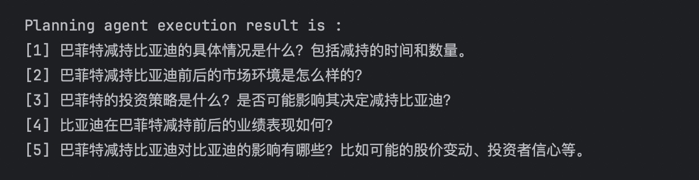
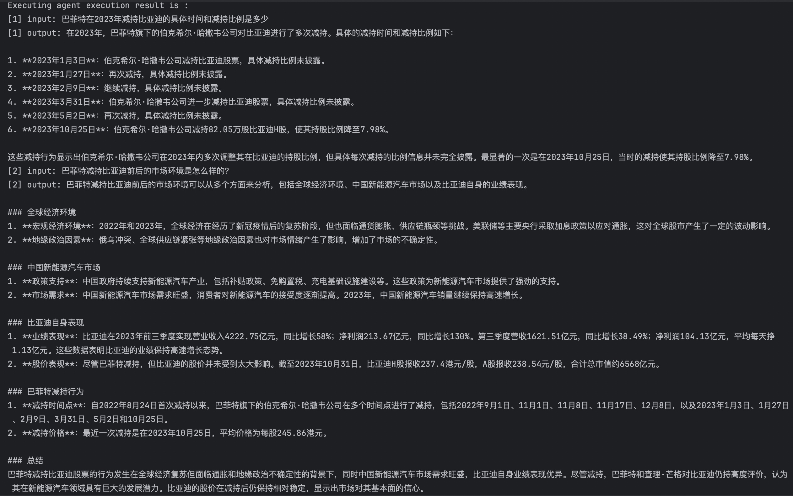
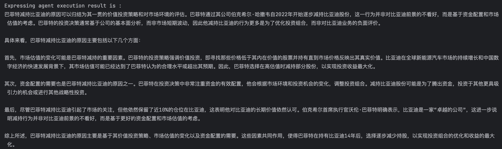
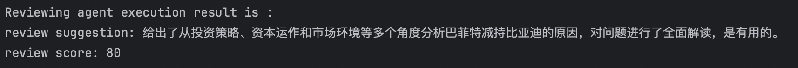

# Financial Event Analysis
## Case Description
This case study is based on PeerPlanner and presents a multi-agent collaborative example focused on analyzing financial events. Specifically, regarding the topic of "Buffett's 2023 Reduction in BYD Shares"， it demonstrates how to utilize the PEER multi-agent collaboration model within the agentUniverse framework. Additionally, it provides detailed configurations and output examples for each agent in PEER.
In this case study, we utilizes the GPT-4o model by OPENAI. Prior to its usage, you need to configure the `OPENAI_API_KEY` in your environment variables.

## Agents
### Planning Agent 
Reference the original code files:
- [Configuration file](../../../../sample_standard_app/app/core/agent/peer_agent_case/demo_planning_agent.yaml)
- [Prompt file](../../../../sample_standard_app/app/core/prompt/planning_agent_cn.yaml)  

The Planning Agent is tasked with breaking down the initial  financial problem into multiple sub-problems that can be independently solved and then provided to the subsequent Executing Agent. In this particular scenario, the overarching question "Analyze the reasons for Buffett's reduction in BYD shares" can be dissected into several sub-questions, as illustrated in the diagram below.




Additionally, you have the ability to debug the Planning Agent independently within the designated [test file](../../../../sample_standard_app/app/test/test_planning_agent.py).

### Executing Agent 
Reference the original code files:
- [Configuration file](../../../../sample_standard_app/app/core/agent/peer_agent_case/demo_executing_agent.yaml)
- [Prompt file](../../../../sample_standard_app/app/core/prompt/executing_agent_cn.yaml)

In this Agent, we provide a tool named[google_search_tool](../../../../sample_standard_app/app/core/tool/google_search_tool.py) for searching information on Google. To utilize this tool, you should configure `SERPER_API_KEY` in your environment variables. For convenience, if the `SERPER_API_KEY ` is not configured, the tool will return a pre-set query result related to this case, which you can find in the [mock_search_tool](../../../../sample_standard_app/app/core/tool/mock_search_tool.py).


The Executing Agent is responsible for solving the sub-problems that have been broken down by the Planning Agent. In this particular case, the execution results of the Executing Agent are as follows: 


Due to the length of the result, only the execution results of the first two questions are displayed here. You can debug the Executing Agent independently in the designated[test file](../../../../sample_standard_app/app/test/test_executing_agent.py) to obtain the complete results.

### Expressing Agent 
Reference the original code files:
- [Configuration file](../../../../sample_standard_app/app/core/agent/peer_agent_case/demo_expressing_agent.yaml)
- [Prompt file](../../../../sample_standard_app/app/core/prompt/expressing_agent_cn.yaml)  

The Expressing Agent is responsible for summarizing all the results outputted by the Executing Agent and formulating them into an answer to the original question, adhering to the requirements specified in the prompt file. In thisinstance, the output result of the Expressing Agent is as follows:




You can debug the Expressing Agent individually in the [test file](../../../../sample_standard_app/app/test/test_expressing_agent.py).

### Reviewing Agent 
Reference the original code files:
- [Configuration file](../../../../sample_standard_app/app/core/agent/peer_agent_case/demo_reviewing_agent.yaml)

The Reviewing Agent is responsible for evaluating whether the answer produced by the Expressing Agent effectively addresses the original question. In this particular case, the Reviewing Agent accepted the answer provided by the Expressing Agent:




You can debug the Reviewing Agent individually in the [test file](../../../../sample_standard_app/app/test/test_reviewing_agent.py).

### PEER Agent 
```yaml
info:
  name: 'demo_peer_agent'
  description: 'demo peer agent'
plan:
  planner:
    name: 'peer_planner'
    eval_threshold: 60
    retry_count: 2
    planning: 'demo_planning_agent'
    executing: 'demo_executing_agent'
    expressing: 'demo_expressing_agent'
    reviewing: 'demo_reviewing_agent'
metadata:
  type: 'AGENT'
  module: 'agentuniverse.agent.default.peer_agent.peer_agent'
  class: 'PeerAgent'
```
Users can configure the four Agents mentioned above into a complete PEER Agent within the agentuniverse through the `peer_planner` collaboration model. The configurations include:
- name: Set as `peer_planner`, indicating the utilization of the PEER multi-agent collaboration model.
- eval_threshold: The minimum score threshold that the Reviewing Agent must achieve to accept an answer.
- retry_count: The number of retry attempts for the PEER Agent if the Reviewing Agent rejects the answer.
- planning：The Agent responsible for the Plan part.
- executing：The Agent responsible for the Execute part.
- expressing：The Agent responsible for the Express part.
- reviewing：The Agent responsible for the Review part.

You can run the complete case in the [example file](../../../../sample_standard_app/app/examples/peer_chat_bot.py).

