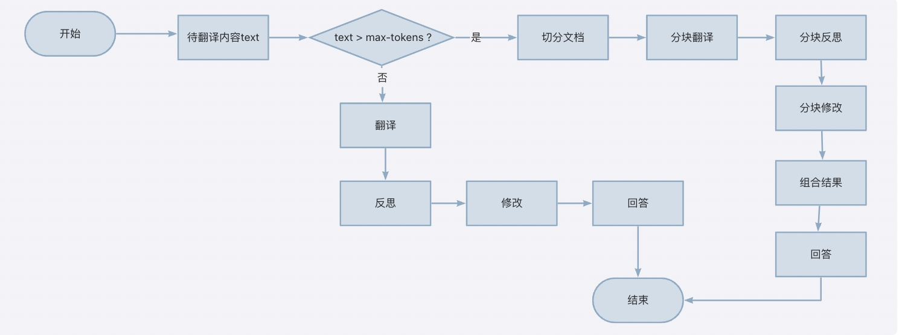
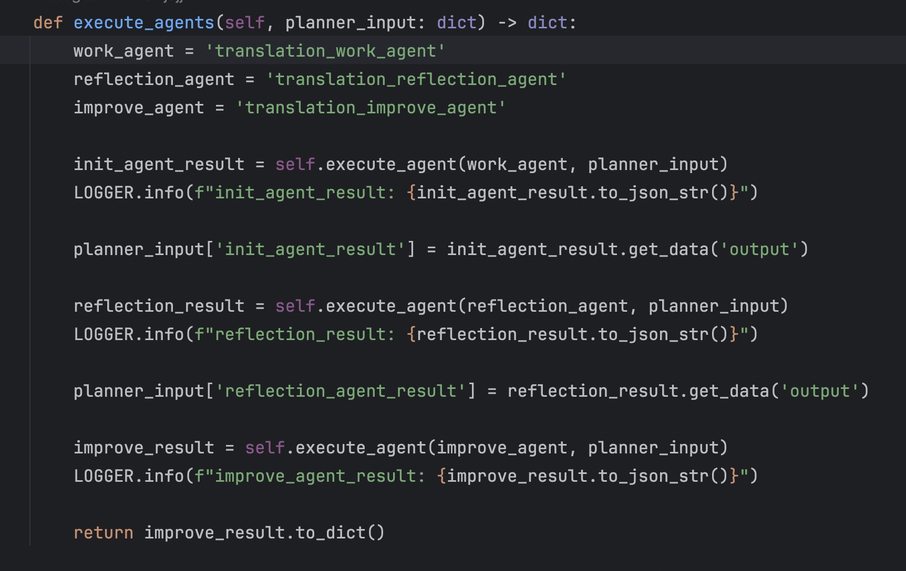
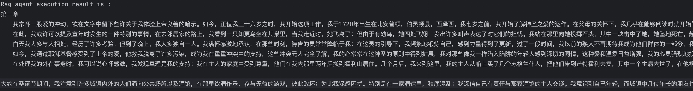
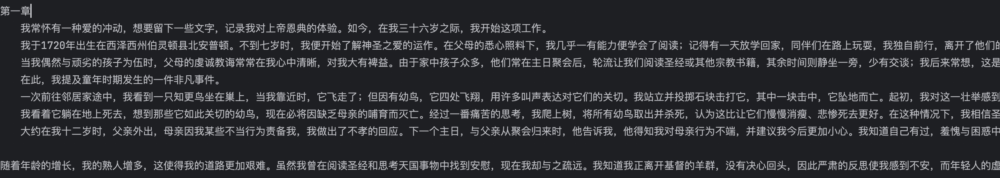

# Translation Assistant
Recently, Professor Andrew Ng of Stanford University open-sourced an AI agent for machine translation, which employs a reflective workflow for translation process. This project serve as an example of machine translation utilizing the reflective agent workflow. The primary steps of the agent are as follow:
1. Initial translation, where a large model (LLM) is utilized to translate text from the source language to the target language.
2. Reflection, in which the large model identifies deficiencies in the translation and proposes constructive improvement suggestions.
3. Revision of the translation, where the large model retranslates the text based on the suggestions derived from the reflection process.

The reflective workflow employed in this project enables the model to identify its own deficiencies and implement targeted revisions, constituting a typical multi-agent collaborative working mechanism. This is also an area in which agentUniverse has been actively engaged, prompting me to contemplate the migration of Andrew Ng's translation agent to agentUniverse framework.
This case is based on the Qianwen large model. Prior to use, you need to configure the `DASHSCOPE_API_KEY` in the environment variables.

## Collaborative Working Process of Multi-Agents
During the translation process, the priority is to ascertain whether the model's length surpasses the maximum number of tokens it can accommodate. For instances where the length exceeds the limit, the text is initially segmented, followed by the translation of each segment. However, the entire translation process adheres to the initial translation -> reflection -> revision workflow.

Implementing this translation in agentUniverse involves the following steps:
1. Define prompts related to translation, with three for short text and three for long text. Relevant files include:
   - [Short Text Init Prompt](../../../../sample_standard_app/app/core/prompt/translation/translation_init_en.yaml)
   - [Short Text Reflection Prompt](../../../../sample_standard_app/app/core/prompt/translation/translation_reflection_en.yaml)
   - [Short Text Improve Prompt](../../../../sample_standard_app/app/core/prompt/translation/translation_improve_en.yaml)
   - [Long Text Init Prompt](../../../../sample_standard_app/app/core/prompt/translation/multi_translation_init_en.yaml)
   - [Long Text Reflection Prompt](../../../../sample_standard_app/app/core/prompt/translation/multi_translation_improve_en.yaml)
   - [Long Text Improve Prompt](../../../../sample_standard_app/app/core/prompt/translation/multi_translation_improve_en.yaml)  
2. Define three agents  
   - [Short Text Translation Work Agent](../../../../sample_standard_app/app/core/agent/translation_agent_case/translation_work_agent.yaml)  
   - [Short Text Translation Reflection Agent](../../../../sample_standard_app/app/core/agent/translation_agent_case/translation_reflection_agent.yaml)  
   - [Short Text Translation Improvement Agent](../../../../sample_standard_app/app/core/agent/translation_agent_case/translation_improve_agent.yaml)  
   These agents switch their prompts based on whether the task involves translating long or short texts. The specific logic for this switching mechanism is detailed in the [agent file](../../../../sample_standard_app/app/core/agent/translation_agent_case/translation_agent.py).

3. Define the collaborative work process of the three agents
The collaborative process is illustrated in the earlier-mentioned flowchart of multi-agent collaboration. 

For a deeper dive into the processes, refer to the [detailed code file](../../../../sample_standard_app/app/core/agent/translation_agent_case/translation_by_token_agent.py).  
The [configuration file](../../../../sample_standard_app/app/core/agent/translation_agent_case/translation_agent.yaml) for the collaborative agents.

### Demonstration Code  
[Code Link](../../../../sample_standard_app/app/test/test_translation_agent.py)

[Long Text](../../../../sample_standard_app/app/test/translation_data/long_text.txt)  
[Short Text](../../../../sample_standard_app/app/test/translation_data/short_text.txt)  

[Translation Of Long Text](../../../../sample_standard_app/app/test/translation_data/short_text_result.txt)  
[Translation Of Short Text](../../../../sample_standard_app/app/test/translation_data/long_text_result.txt)  

### Demonstration Results
We can see that using agentUniverse maintains consistency with the results of the orginal translation_agent project, which hasa been successfully replicated.
agentUniverse Results:  

translation_agent Results:  

### Others
In reference to Professor Andrew Ng's code, when managing segmented translations, to ensure the coherence of the translation, each segment is translated with its corresponding context. However, incorporating all translation content into the context within his code can undermine the original intent of segmentation, and in certain cases, it can result in exceeding the model's taken capacity. I have raised a related issue on the corresponding repository address:  [Issue Link](https://github.com/andrewyng/translation-agent/issues/28)## Implementation in agentUniverse.

