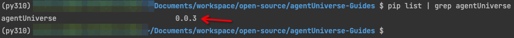

# Installation
## Python version requirements
- python 3.10+

We recommend using python 3.10 or later to ensure optimal performance and functionality. The entire project has successfully passed all tests on Python 3.10.0 and later versions. If you are using a Python version lower than 3.10, we cannot guarantee that the project will run correctly.


## Installation method
### Install via pip
```shell
pip install agentUniverse
```
More version information can be found on the
[PyPi agentUniverse](https://pypi.org/project/agentUniverse/)

### Install via poetry or other package management tools
In actual projects, we recommend using Poetry or other tools to manage your project dependencies. You can install agentUniverse using the following command:

```shell
poetry add agentUniverse
```

Alternatively, you can add the following content to your `pyproject.toml` file:

```toml
[tool.poetry.dependencies]
agentUniverse = "^0.0.3"
```
A standard `pyproject.toml` file for a standard project can be found [here](../../../../sample_standard_app/pyproject.toml).

To update your dependencies, use the `poetry update` command:
```shell
poetry update
```

## Verify installation
```shell
pip list | grep agentUniverse
```
If you see `agentUniverse` and its version numberin the output, the installation was successful.


