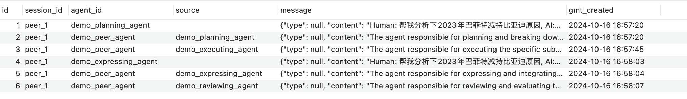
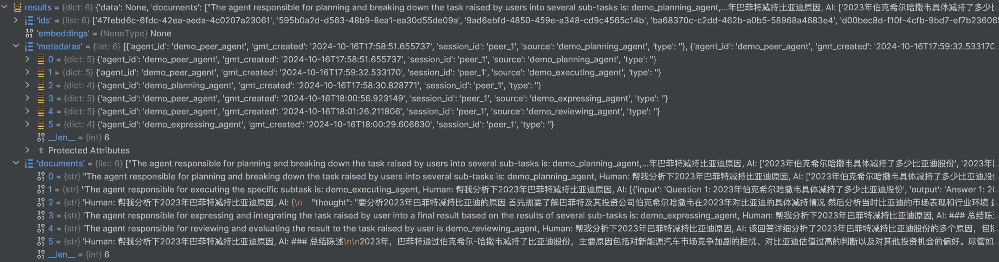

# 如何定义记忆Memory组件

根据agentUniverse领域组件的设计特性，同其他组件一样，创建一个记忆memory定义由2部分组成:

- xx_memory.yaml
- xx_memory.py

xx_memory.yaml包含了memory组件的名称、描述、类型、记忆压缩器、记忆存储器等重要信息；xx_memory.py包含了记忆的具体定义。理解这一原理后，让我们具体看看该如何创建这两部分内容。

# 如何使用记忆Memory组件

## 创建记忆配置 - xx_memory.yaml

### 一个记忆定义配置的实际样例

```yaml
name: 'demo_memory'
description: 'demo memory with multiple storages'
memory_key: 'chat_history'
max_tokens: 3000
memory_compressor: default_memory_compressor
memory_storages:
  - chroma_memory_storage
  - mysql_memory_storage
memory_retrieval_storage: chroma_memory_storage
metadata:
  type: 'MEMORY'
  module: 'agentuniverse.agent.memory.memory'
  class: 'Memory'
```

- name: 记忆组件的名称
- description: 记忆组件的描述
- memory_key: 记忆组件的key，对应agent智能体的prompt中的记忆变量名称
- max_tokens: 记忆信息在prompt中的token上限，超过该上限时，memory组件会自动进行压缩
- memory_compressor: 记忆组件的压缩器，用于对记忆进行压缩
- memory_storages: 记忆组件的存储器列表，用于对记忆进行多路存储，若用户未配置，默认使用local_memory_storage本地内存存储器
- memory_retrieval_storage: 记忆组件的存储检索器，代表记忆的检索源，若用户未配置，默认使用memory_storages中的第一个记忆存储组件
- metadata: 记忆组件的元数据，用于标识记忆组件的类型、模块和类名

aU sample工程中包含两种记忆配置样例:

1. [demo_memory_with_chroma_storage](../../../sample_standard_app/intelligence/agentic/memory/demo_memory_a.yaml) 挂载chroma存储器的记忆示例
2. [demo_memory_with_local_storage](../../../sample_standard_app/intelligence/agentic/memory/demo_memory_b.yaml) 挂载本地内存存储器的记忆示例


## 创建Memory领域行为定义 - xx_memory.py

agentUniverse提供了一个标准的Memory类，您可以直接在yaml定义文件中使用该类或是继承它并改写其中的部分方法。

### [Memory类的定义:](../../../agentuniverse/agent/memory/memory.py)

- add(self, message_list: List[Message], session_id: str = '', agent_id: str = '', **kwargs) -> None:
  : 添加记忆，获取记忆实例中配置的多个`memory_storage`
  （记忆存储）领域组件，将记忆的消息列表、智能体id（agent_id）、会话id（session_id）、source（记忆来源）等信息，进行多路存储。

- delete(self, session_id: str = None, **kwargs) -> None:
  : 删除记忆，获取记忆实例中配置的多个`memory_storage`（记忆存储）领域组件，根据会话id（session_id）条件过滤，进行多路删除。

- get(self, session_id: str = '', agent_id: str = '', **kwargs) -> List[Message]:
  : 记忆检索，获取记忆实例中配置的`memory_retrieval_storage`领域组件（若用户未配置，默认使用`memory_storages`
  中的第一个记忆存储组件），根据智能体id（agent_id）、会话id（session_id）、source（记忆来源），进行记忆检索。

- prune(self, memories: List[Message]) -> List[Message]:
  : 记忆裁剪压缩，获取记忆实例中配置的`max_tokens`参数（prompt中记忆的最大token数）和`memory_compressor`
  （记忆压缩）领域组件，若检索记忆流程中获取的记忆信息超过最大token数，则进行裁剪压缩。

## 在Agent中配置使用

您可以根据[智能体创建与使用](2_2_1_智能体创建与使用.md)中的内容在agent的memory中设置您的memory实例。如上文中创建的`demo_memory`实例，在agent中您可以这样设置：

```yaml
info:
  name: 'demo_agent'
  description: 'demo agent'
# omitted part
memory:
  name: 'demo_memory'
# omitted part
```

### 案例
例如在PEER工作模式下，将aU sample工程中的[demo_planning_agent](../../../sample_standard_app/intelligence/agentic/agent/agent_instance/peer_agent_case/demo_planning_agent.yaml)/[demo_expressing_agent](../../../sample_standard_app/intelligence/agentic/agent/agent_instance/peer_agent_case/demo_expressing_agent.yaml)/[demo_peer_agent](../../../sample_standard_app/intelligence/agentic/agent/agent_instance/peer_agent_case/demo_peer_agent.yaml)三个智能体配置上文中创建的`demo_memory`实例，执行一次peer调用时，传入的`session_id`为`peer_1`，调用完成后查看memory的存储内容如下：

#### mysql_memory_storage


#### chroma_memory_storage


## 使用Memory管理器

通过Memory管理器中的`.get_instance_obj(xx_memory_name)` 方法可以获取对应名称的Memory内容。

```python
from agentuniverse.agent.memory.memory_manager import MemoryManager

memory_name = 'xxx'
memory = MemoryManager().get_instance_obj(component_instance_name=memory_name)
```

# 总结

至此您已经掌握了记忆Memory的基本使用方法，具体`memory_compressor`和`memory_storage`领域组件内容可查阅[MemoryCompressor文档](2_2_5_MemoryCompressor.md)和[MemoryStorage文档](2_2_5_MemoryStorage.md)。

赶快去尝试使用Memory吧。