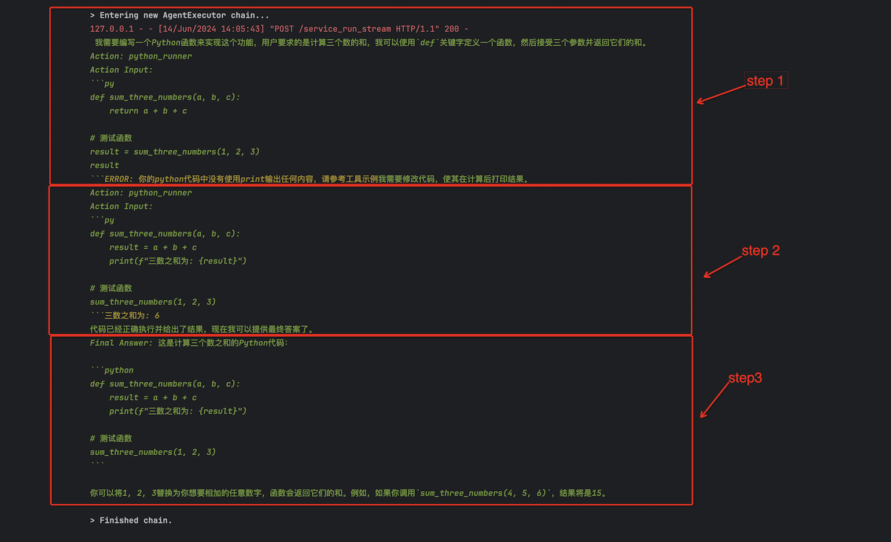

# Python自动执行案例
## 案例说明
本案例基于ReactPlanner，搭建了一个简单可以自动生成python代码并执行的案例。

该案例基于千问大模型和`goolge_search`功能，使用前需要您在环境变量中配置`DASHSCOPE_API_KEY`、`SERPER_API_KEY`。

## 快速开始
### 配置API密钥
比如在agentUniverse管理私有密钥配置的文件`custom_key.toml`中配置密钥信息（讨论组默认使用qwen作为基座模型，serper作为google search工具）
```toml
[KEY_LIST]
# serper google search key
SERPER_API_KEY='xxx'
# openai api key
DASHSCOPE_API_KEY='xxx'
```

### 创建Agent
```yaml
info:
  name: 'demo_react_agent'
  description: 'react agent'
profile:
  prompt_version: qwen_react_agent.cn
  llm_model:
    name: 'default_qwen_llm'
    model_name : 'qwen-max'
    temperature: 0
action:
  tool:
    - 'google_search_tool'
    - 'python_runner'
plan:
  planner:
    name: 'react_planner'
metadata:
  type: 'AGENT'
  module: 'agentuniverse.agent.default.react_agent.react_agent'
  class: 'ReActAgent'
```

这里使用了google_search_tool与python_runner两个工具，相关工具代码链接如下：
- [google_search_tool](../../../sample_standard_app/app/core/tool/google_search_tool.yaml)
- [python_runner](../../../sample_standard_app/app/core/tool/python_repl_tool.yaml)


### 代码运行
1. 测试用例运行
直接使用测试代码运行[test_case](../../../sample_standard_app/app/test/test_react_agent.py)
2. 接口运行
配置好相关key之后，启动web服务，使用下面的curl进行测试
```shell
curl --location --request POST 'http://localhost:8888/service_run' \
--header 'Cookie: spanner=fQ47DxJmWYzf8rKDhs69LExySZYZFUiVXt2T4qEYgj0' \
--header 'Content-Type: application/json' \
--data-raw '{
    
    "service_id": "demo_react_service",
    "params": {
        "input": "请帮我生成一段python代码，可以计算三数之和"
    }
}'
```

### 执行结果


图片中，react一共执行了三步：  
    第一步，模型根据问题给出了一段python代码，并交给python_runner工具执行，但是执行失败了，失败原因是没有使用print打印执行结果。  
    第二步，模型意识到错误，主动修改了代码，再次使用python_runner工具执行，执行成功。  
    第三步，模型将执行成功的代码告诉给用户。  

### 注意
受限于模型能力问题，建议使用qwen-max模型进行测试