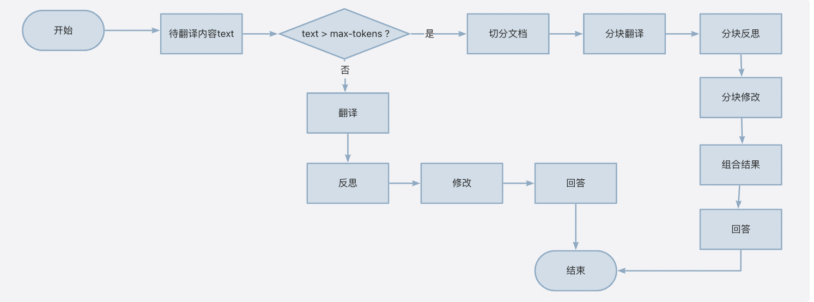
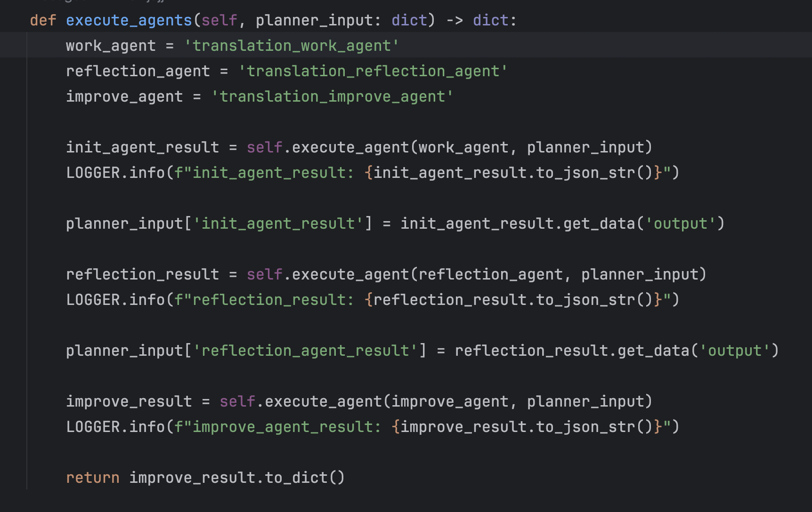
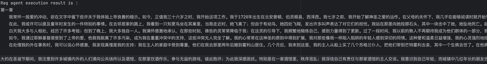
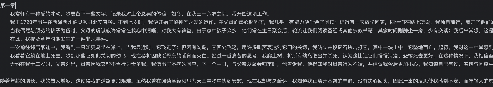

# 翻译案例
近期，斯坦福大学教授吴恩达开源了一个AI智能体机器翻译——一个使用反思工作流进行翻译的智能体，该项目中演示了反思智能体工作流的机器翻译示例。该智能体的主要步骤如下：
1. 初始翻译，使用大模型（LLM）将文本从source_language翻译为target_language;
2. 进行反思，让大模型指出翻译结果中的不足，并给出建设性的改进建议；
3. 修改翻译，让大模型根据反思给出的建议，重新进行翻译；
项目中采用的反思工作流，让模型自己去发现不足，在根据不足做定向的修改，是一种典型的多智能体协同工作机制，这也是agentUniverse一直涉足的领域，于是我就有将吴恩达的这个翻译智能体迁移到agentUniverse上面的想法。  
该案例基于千文大模型，使用前需要您在环境变量中配置`DASHSCOPE_API_KEY`。

## 多智能体的协同工作过程
翻译过程中，优先判断模型的长度是否超过了模型所能承受的最大token,针对超过模型长度的情况,先对分本进行切块，再分块进行翻译，
但整个翻译过程都是基于初始翻译->反思->修改的流程进行的。

在参考吴恩达教授的代码当中，处理分块翻译时，为了保证翻译的连贯性，翻译每一个分块时，会携带相应的上下文。但是在他的代码当中将所有的翻译内容都放在的上下文当中，会使切分失去原本的意义，某些情况下会导致token超过模型所能接受的最大token，针对此问题我在对应的仓库地址提问了相关issue:[issue地址](https://github.com/andrewyng/translation-agent/issues/28)

## 在aU中的实现
在aU中实现该翻译的过程主要分为以下几步：
1. 定义翻译相关的prompt，短文本翻译三个，长文本翻译三个，相关文件如下:  
[短文本翻译init prmpt](../../../sample_standard_app/app/core/prompt/translation/translation_init_en.yaml)  
[短文本翻译reflection prmpt](../../../sample_standard_app/app/core/prompt/translation/translation_reflection_en.yaml)  
[短文本翻译improve prmpt](../../../sample_standard_app/app/core/prompt/translation/translation_improve_en.yaml)  
[长文本翻译init prmpt](../../../sample_standard_app/app/core/prompt/translation/multi_translation_init_en.yaml)  
[长文本翻译reflection prmpt](../../../sample_standard_app/app/core/prompt/translation/multi_translation_improve_en.yaml)  
[长文本翻译improve prmpt](../../../sample_standard_app/app/core/prompt/translation/multi_translation_improve_en.yaml)  

2. 定义三个智能体  
[短文本翻译智能体](../../../sample_standard_app/app/core/agent/translation_agent_case/translation_work_agent.yaml)  
[短文本翻译智能体](../../../sample_standard_app/app/core/agent/translation_agent_case/translation_reflection_agent.yaml)  
[短文本翻译智能体](../../../sample_standard_app/app/core/agent/translation_agent_case/translation_improve_agent.yaml)  
该智能体当中，需要根据执行的时长文本翻译还是短文本翻译切换对应的prompt，具体逻辑可参考[agent](../../../sample_standard_app/app/core/agent/translation_agent_case/translation_agent.py)
3. 定义三个智能体的协同工作过程
协同过程可参考前面介绍的多智能体协同工作过程的流程图    
  
更细的流程可以参考[代码文件](../../../sample_standard_app/app/core/agent/translation_agent_case/translation_by_token_agent.py)
协同智能体的[配置文件](../../../sample_standard_app/app/core/agent/translation_agent_case/translation_agent.yaml)

### 演示代码
[代码链接](../../../sample_standard_app/app/test/test_translation_agent.py)

[长翻译文本](../../../sample_standard_app/app/test/translation_data/long_text.txt)  
[短翻译文本](../../../sample_standard_app/app/test/translation_data/short_text.txt)  

[短翻译结果](../../../sample_standard_app/app/test/translation_data/short_text_result.txt)  
[长翻译结果](../../../sample_standard_app/app/test/translation_data/long_text_result.txt)  

### 演示结果
可以看到，使用aU与原本的translation_agent原工程翻译结果保持一致，复刻成功。
aU的执行结果:  
  
translation_agent的执行结果:  
  