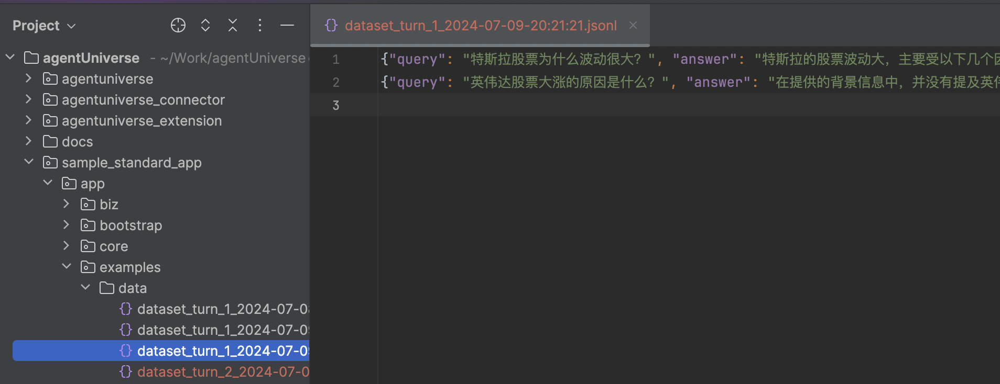
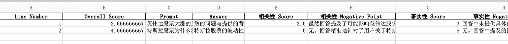
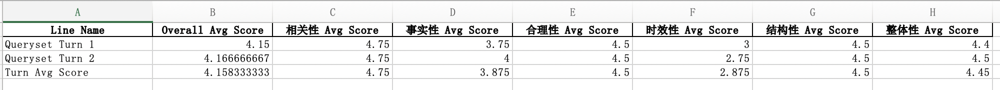
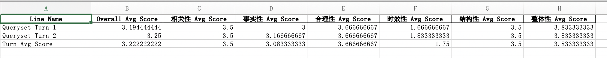

# 数据自治智能体
## 介绍

数据自治智能体全貌：通过**自动化批量执行多轮智能体调用**，**离线自适应数据采集**，**生产评测数据集**，**生产微调数据集**，**模型推理训练**，**数据集多维度自动评估**等完整的workflow，以强化大模型和Agent的数据自治流程。

当前agentUniverse开放了**数据自治MVP（最小可行产品）版本**，根据用户指定的**问题集**，**自动化批量执行多轮智能体调用**，**生产评测数据集**，**数据集多维度自动评估**，**产出评测报告**，将数据自治思想传递到开源社区，后续将陆续开放数据自治workflow完整能力。

## 背景

当前，行业内对Agent智能体效果的测评，通常需要依赖于特定领域的专家进行大量的人工评审和标注，以确保评估结果的高质量和准确性。

dataAgent希望通过智能体本身的能力，对Agent数据进行**自采集、自管理，以及智能化评判**。

在我们开放的mvp版本中，您可以通过`dataset_build_agent`智能体对于待评测的问题集进行多轮次的批量调用，生产评测数据集；之后通过`dataset_eval_agent`智能体采用蚂蚁公布的Fin-Eva数据评测标准基于7个维度（相关性、事实性、合理性、时效性、结构性、整体性、全面性）进行智能体数据评估和标注，将多轮次评测结果进行丰富的统计学分析，以提供给用户更直观的Agent能力变化。

通过一整套数据自治能力，可以非常轻松的通过智能化产出的评测报告，了解到您的智能体当前处于什么水平。

需要特别说明的是，整个评测报告分数为参考值，在实际投产过程中，我们将多轮多次得分进行综合对比，以分辨智能体效果好坏。


## dataAgent流程图

- data_agent包含两部分，**dataset_build_agent**负责自动化批量执行多轮智能体调用，生产评测数据集
- **dataset_eval_agent**负责自动化多维度评估数据集，产出评测报告

## dataAgent执行步骤
### step1 建立智能体问题集
在dataAgent中，首先需要构建一个智能体问题集，以jsonl文件格式，其中每一行代表一次智能体调用的完整输入。

如下所示，建立3条问题集，input对应智能体的query信息：
```jsonl
{"input": "帮我预测下2024欧洲杯冠军"}
{"input": "半导体还能继续持有吗"}
{"input": "北京今天天气如何"}
```
### step2 配置dataAgent
配置dataAgent智能体，如下所示，配置文件除智能体基本配置外，主要包含两个重要项，`dataset_builder`对应生产评测数据集的智能体名称，`dataset_evaluator`对应数据集评估标注的智能体名称。
```yaml
info:
  name: 'data_agent'
  description: 'data agent'
plan:
  planner:
    dataset_builder: 'dataset_build_agent'
    dataset_evaluator: 'dataset_eval_agent'
metadata:
  type: 'AGENT'
  module: 'sample_standard_app.app.core.agent.data_agent_case.data_agent'
  class: 'DataAgent'
```
[data_agent配置文件样例地址](../../../sample_standard_app/app/core/agent/data_agent_case/data_agent.yaml)

[data_agent代码地址](../../../sample_standard_app/app/core/agent/data_agent_case/data_agent.py)

### step3 配置生产评测数据集的智能体
以step2中`dataset_builder`配置的**dataset_build_agent**，如下所示为dataset_build_agent的配置文件，配置文件除智能体基本配置外，主要包含两个重要项，`candidate`配置待评测的智能体名称（如评测demo_rag_agent效果，candidate配置demo_rag_agent），`concurrency_level`配置批量执行智能体调用时的并发度（如配置5，代表并发5调用candidate智能体）
```yaml
info:
  name: 'dataset_build_agent'
  description: 'dataset build agent'
profile:
  concurrency_level: 1
plan:
  planner:
    candidate: 'demo_rag_agent'
metadata:
  type: 'AGENT'
  module: 'sample_standard_app.app.core.agent.data_agent_case.dataset_build_agent'
  class: 'DatasetBuildAgent'
```
[dataset_build_agent配置文件样例地址](../../../sample_standard_app/app/core/agent/data_agent_case/dataset_build_agent.yaml)

[dataset_build_agent代码地址](../../../sample_standard_app/app/core/agent/data_agent_case/dataset_build_agent.py)

### step4 配置数据集评估标注的智能体
以step2中`dataset_evaluator`配置的**dataset_eval_agent**，如下所示为dataset_eval_agent的配置文件，配置文件除智能体基本配置外，主要包含两个重要项，`llm_model`配置智能体模型，`max_eval_lines`配置评测数据行数（如配置10代表只评估前10条评测数据，避免全局评测，消耗巨大token量）
```yaml
info:
  name: 'dataset_eval_agent'
  description: 'dataset eval agent'
profile:
  prompt_version: dataset_eval_agent.cn
  max_eval_lines: 10
  llm_model:
    name: 'qwen_llm'
    model_name: 'qwen2-72b-instruct'
    temperature: 0.1
metadata:
  type: 'AGENT'
  module: 'sample_standard_app.app.core.agent.data_agent_case.dataset_eval_agent'
  class: 'DatasetEvalAgent'
```
[dataset_eval_agent配置文件样例地址](../../../sample_standard_app/app/core/agent/data_agent_case/dataset_eval_agent.yaml)

[dataset_eval_agent代码地址](../../../sample_standard_app/app/core/agent/data_agent_case/dataset_eval_agent.py)

### step5 运行dataAgent
通过 [dataAgent代码入口](../../../sample_standard_app/app/examples/data_agent.py)，分别配置两个参数，`queryset_path`代表问题集路径，`turn`代表问题集总体执行轮次，一键启动dataAgent。

tips: 请合理配置问题集及具体评测行数，以免造成大量算力及token损耗。

## dataAgent使用示例
参考上文**dataAgent执行步骤**，通过5步，启动配置好的dataAgent。

### 评测数据集
首先生成评测数据集，以jsonl文件的格式存储智能体的q&a对。
如下图所示：
 - `query`: 评测数据问题
 - `answer`: 评测数据答案



[dataAgent生产的评测数据集样例地址](../../../sample_standard_app/app/examples/data/dataset_turn_1_2024-07-10-10-48-30.jsonl)

### 完整评测结果
生产评测数据集后，dataAgent开始数据多维度评估标注，产出完整评测结果（若执行多轮dataAgent跑批任务，则产出多个完整评测结果）。

如下图所示: 
 - `Line Number`: 当前评测数据在数据集中的行数
 - `Overall Score`: 综合分数 = 多个维度的评估分数总和 / 评估维度个数（满分5分，分数范围0-5）
 - `Query`: 评测数据问题
 - `Answer`: 评测数据答案
 - `相关性 Score`: 代表评测数据答案与问题的相关性，分数越高越相关（满分5分，分数范围0-5）
 - `相关性 Suggestion`: 代表相关性维度存在的问题和改进建议
 - 更多维度 Score/Suggestion 以此类推


评估节点发现的问题：
 - 例如第1条数据在**相关性维度的suggestion**: 虽然回答了关于北京天气的问题，但提供的温度单位为华氏度，与国内用户习惯的摄氏度不符，建议转换为摄氏度并提供更全面的天气信息，如湿度、风力等。
 - 例如第3条数据在**事实性维度的suggestion**: 回答中包含事实错误，如将阿根廷球星莱昂内尔·梅西错误地归入英格兰队。优化建议是确保所有提及的数据和事实准确无误，尤其是在涉及具体人物和事件时。

[dataAgent生产的完整评测结果样例地址](../../../sample_standard_app/app/examples/data/eval_result_turn_1_2024-07-10-10-48-30.xlsx)

### 综合评测报告
根据多轮完整的评测结果，生成一份综合评测报告。

如下图所示: 
 - `Line Name`: 包含两种类型，如`Queryset Turn x`代表根据问题集第x轮生成的评测数据集, `Turn Avg Score`代表多轮多维度的平均分数
 - `Overall Avg Score`: 单轮数据集中所有数据的综合分数总和 / 数据集中对应数据量（满分5分，分数范围0-5）
 - `相关性 Avg Score`: 单轮数据集中所有数据的相关性分数总和 / 数据集中对应数据量（满分5分，分数范围0-5）
 - 更多维度 Avg Score 以此类推


[dataAgent生产的综合评测报告样例地址](../../../sample_standard_app/app/examples/data/eval_report_2024-07-10-10-48-30.xlsx)

### 对比实验
调整aU中`demo_rag_agent`中的模型从上文生产评测报告时的**qwen1.5-7b-chat**改为**qwen1.5-72b-chat**，通过dataAgent评测后，生成的综合评测报告如下:

下图为模型为qwen1.5-7b-chat时，数据自治智能体产出的综合评测报告:


下图为模型为qwen1.5-72b-chat时，数据自治智能体产出的综合评测报告:

对比两次综合评测报告，可以看到智能体模型从qwen1.5-7b-chat改为qwen1.5-72b-chat后，各维度多轮评分均存在大幅度上升，以此方法快速分辨智能体配置变更后，智能体效果差异。


## dataAgent详细说明
### data_agent
- [配置文件](../../../sample_standard_app/app/core/agent/data_agent_case/data_agent.yaml)
- [智能体文件](../../../sample_standard_app/app/core/agent/data_agent_case/data_agent.py)

### dataset_build_agent
- [配置文件](../../../sample_standard_app/app/core/agent/data_agent_case/dataset_build_agent.yaml)
- [智能体文件](../../../sample_standard_app/app/core/agent/data_agent_case/dataset_build_agent.py)
- dataset_build_agent生产的评测数据以jsonl格式本地存储（jsonl文件名称为dataset_turn_{i}_{date}，`i`代表轮次，`date`代表生成时间）

### dataset_eval_agent
- [配置文件](../../../sample_standard_app/app/core/agent/data_agent_case/dataset_eval_agent.yaml)
- [智能体文件](../../../sample_standard_app/app/core/agent/data_agent_case/dataset_eval_agent.py)
- [提示词文件](../../../sample_standard_app/app/core/prompt/dataset_eval_agent_cn.yaml)：agentUniverse当前开放了6种产业中验证有效的智能体评估标准（MVP版本未开放**全面性维度**，当前全面性评估标准偏向金融领域，故未在开源社区中提及）
- dataset_eval_agent生产的**完整评测结果**以excel格式本地存储（文件名称为eval_result_turn_{i}_{date}，`i`代表轮次，`date`代表生成时间）
- dataset_eval_agent生产的**综合评测报告**以excel格式本地存储（文件名称为eval_report_{date}，date代表生成时间）