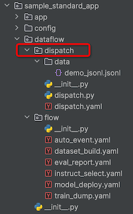
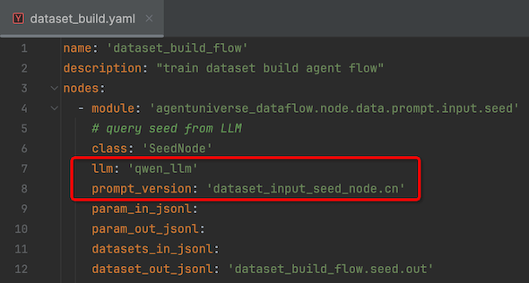

# 项目介绍
agentUniverse-dataflow基于**Agentic Workflow**思想，以多智能体及flow编排的形式，通过**离线自适应数据采集、微调数据集生成、模型推理训练、数据集多维度自动评估**等工作，强化大模型和Agent的数据处理流程。

具体包括：
1. 一套基础数据框架：**DataFramework**, 以Dispatch-Flow-Node-Data/Event/Prompt/Answer/Eval为框架，具有可持续集成和扩展能力
2. 一套智能体框架：**PVRP**「Planner-Verifier-Reflector-Producer」
3. 一套能力： 
   - 自适应数据事件采集 **auto_event**
   - 微调数据集生成 **dataset_build**
   - 上传训练推理 **train_dump**
   - 多维客观自动评估 **eval_report**
   - 模型部署生效 **model_deploy**
   - 系统指令优选 **instruct_select**

# 快速开始
在agentUniverse标准工程模版`sample_standard_app`中：
## step1
配置config.toml中prompt的加载路径，增加`agentuniverse_dataflow.prompt`，读取agentuniverse_dataflow系统内置prompt文件。
```toml
[CORE_PACKAGE]
# Perform a full component scan and registration for all the paths under this list.
default = ['sample_standard_app.app.core']
# Scan and register agent components for all paths under this list, with priority over the default.
agent = ['sample_standard_app.app.core.agent']
# Scan and register agent components for all paths under this list, with priority over the default.
knowledge = ['sample_standard_app.app.core.knowledge']
# Scan and register knowledge components for all paths under this list, with priority over the default.
llm = ['sample_standard_app.app.core.llm']
# Scan and register llm components for all paths under this list, with priority over the default.
planner = ['sample_standard_app.app.core.planner']
# Scan and register planner components for all paths under this list, with priority over the default.
tool = ['sample_standard_app.app.core.tool']
# Scan and register memory components for all paths under this list, with priority over the default.
memory = ['sample_standard_app.app.core.memory']
# Scan and register service components for all paths under this list, with priority over the default.
service = ['sample_standard_app.app.core.service']
# Scan and register prompt components for all paths under this list, with priority over the default.
prompt = ['sample_standard_app.app.core.prompt', 'agentuniverse_dataflow.prompt']
```
## step2
sample_standard_app的dataflow目录下，dispatch作为入口，在`dispatch.yaml`中配置dataflow流程，之后运行`dispatch.py`文件即可（dataflow运行结果以jsonl形式存储在dispatch/data目录下）。

 

在dispatch.yaml文件中，用户可以自定义编辑需要运行的dataflow任务节点，如下文配置文件dataflow运行后，执行**自适应数据事件采集和微调数据集生成**两个任务。
```yaml
name: 'main_dispatch'
description: 'dispatch with multi-dataflows which will execute one after another'
dataflows:
  - ../flow/auto_event.yaml
  - ../flow/dataset_build.yaml
```
# Dataflow介绍
agentUniverse-dataflow目前支持6种flow，分别为`auto_event/dataset_build/train_dump/eval_report/model_deploy/instruct_select`，每个flow通过node组合形成对应的pipeline。
## Dataflow流程图
 

在每个flow的yaml配置文件，各node节点包含llm、prompt version配置信息，用户可自定义llm基座模型和prompt，实现版本管理和快捷切换。
例如，下图中node节点使用sample工程的qwen基座模型和agentuniverse-dataflow系统内置的prompt文件：

  
## 各Flow具体详情
**特殊说明：** 
dataflow中`auto event/dataset build/eval report/instruce select`为用户可以**直接运行体验的flow节点**，`train dump/model deploy`节点**理念先行**，目前在蚂蚁集团内已通过标准的模型部署和训练平台运行，开源社区版本后续考虑开放。

### Auto Event
Auto Event主要功能是通过采集不同数据源，感知数据源中对应agent运行时的日志信息， 提取有效输入输出生成特定jsonl文件（当前支持采集jsonl数据源，更多数据源类型持续开放）。

Auto Event包含3个node，`Perceiver/Planner/Executor`，pipeline流程通过yaml配置，示例配置文件为sample_standard_app中的auto_event.yaml。
 - Perceiver Node: 感知数据源，提取数据源中的原始输入输出
 - Planner Node: 生成代码用来提取数据源中的有效模型输入输出
 - Executor Node: 执行代码提取数据源中的有效模型输入输出

### Dataset Build
Dataset Build主要功能是生成特定领域高质量模型问答数据集。

Dataset Build包含6个node，`Seed/Rewrite/Extend/Dedupe/Answer/Filter`，pipeline流程通过yaml配置，示例配置文件为sample_standard_app中的dataset_build.yaml。
 - Seed Node: 用户指定领域，生产粗略query集
 - Rewrite Node: 粗版query集改写为标准query集
 - Extend Node: 扩充query集
 - Dedupe Node: 对query集内容去重
 - Answer Node: query集，模型调用生成问答结果集
 - Filter Node: 专业领域评价标准，过滤有效数据集

### Train Dump
Train Dump主要功能是上传指定数据集，sft训练模型，dump问答结果集。

Train Dump包含4个node，`Upload/Train/PreDeploy/Dump`，pipeline流程通过yaml配置，示例配置文件为sample_standard_app中的train_dump.yaml。
 - Upload Node: 上传数据集到模型训练平台
 - Train Node: 根据微调数据集训练模型
 - PreDeploy Node: 预部署训练后模型
 - Dump Node: 指定query集，dump问答结果

### Eval Report
Eval Report主要功能是多维度评估问答结果集质量，生成评估报告。

Eval Report包含2个node，`Eval/Report`，pipeline流程通过yaml配置，示例配置文件为sample_standard_app中的eval_report.yaml。
 - Eval Node: 多维度评估问答结果集质量
 - Report Node: 生产质量评估报告

### Model Deploy
Model Deploy主要功能是正式部署训练后模型，dump问答数据集。

Model Deploy包含2个node，`Deploy/Dump`，pipeline流程通过yaml配置，示例配置文件为sample_standard_app中的model_deploy.yaml。
 - Deploy Node: 正式部署训练后模型
 - Dump Node: 指定query集，dump问答结果

### Instruct Select
Instruct Select主要功能是生成指令集，拼接完整prompt集，dump问答数据集，评估问答质量。

Instruct Select包含4个node，`Seed/PromptGen/Dump/Eval`，pipeline流程通过yaml配置，示例配置文件为sample_standard_app中的instruct_select.yaml。
 - Seed Node: 用户指定领域，生产指令集
 - PromptGen Node: 指令集+query集合并完整prompt集
 - Dump Node: 指定prompt集，dump问答结果
 - Eval Node: 多维度评估问答结果集质量