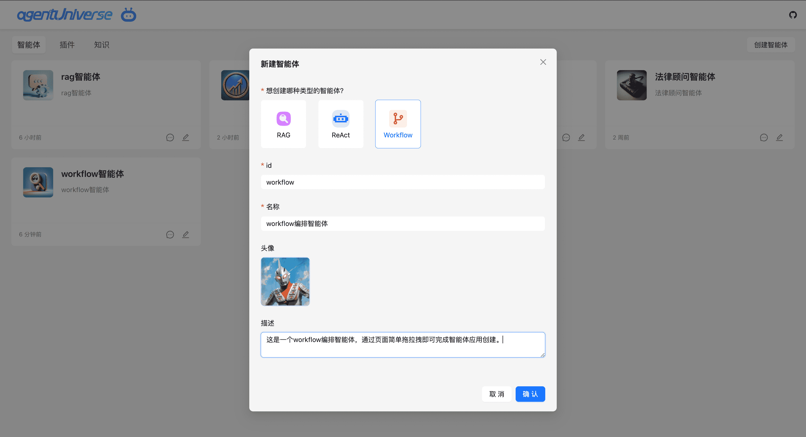
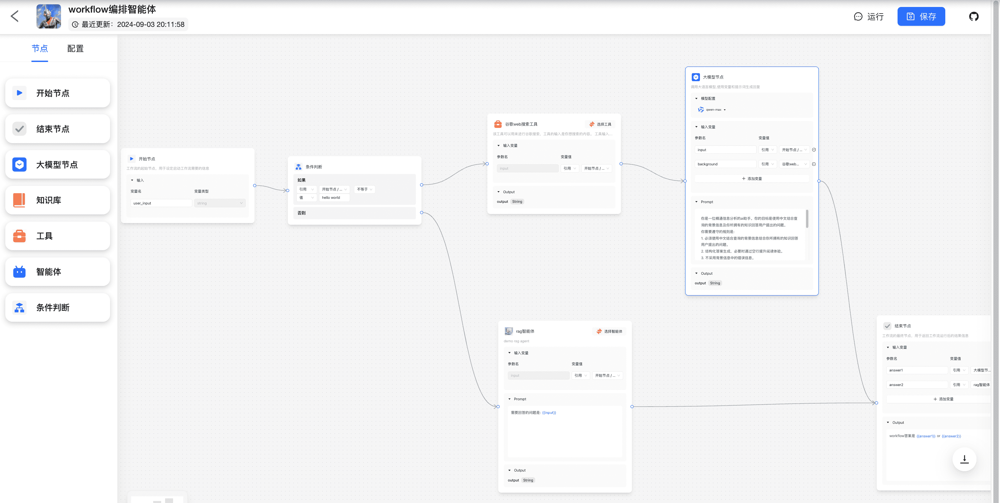
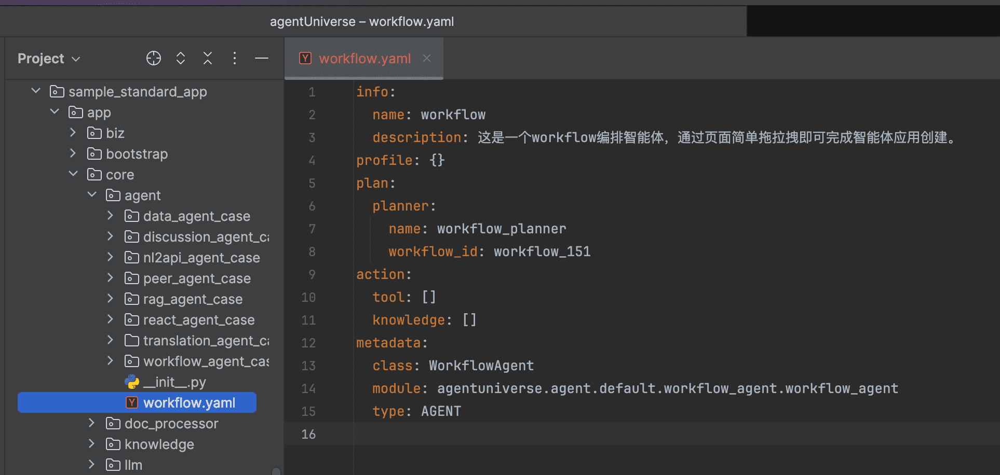
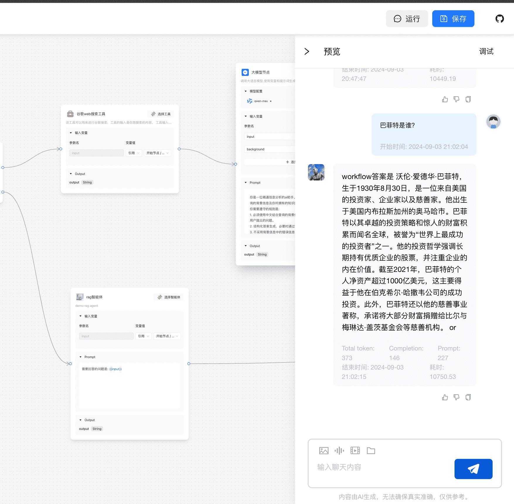
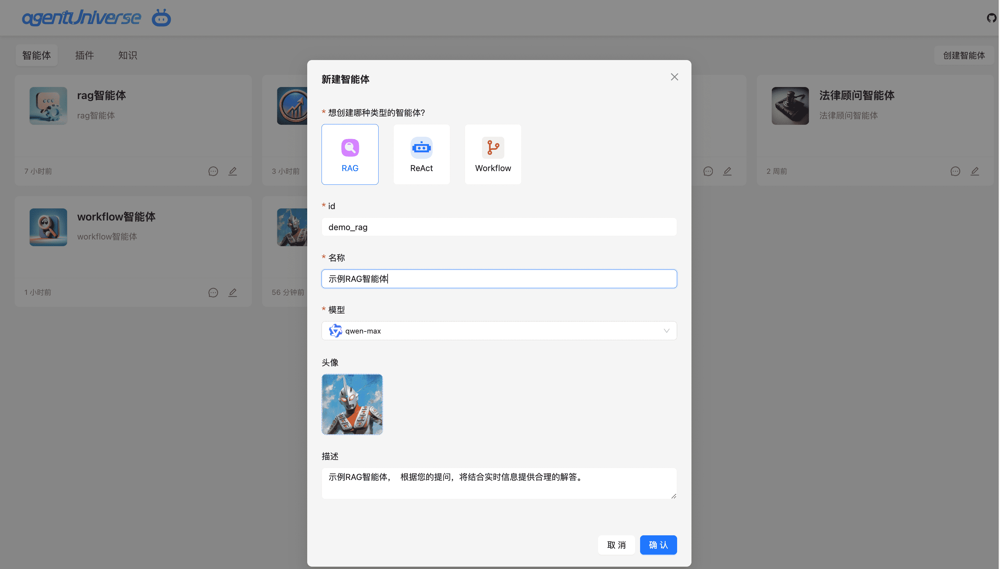
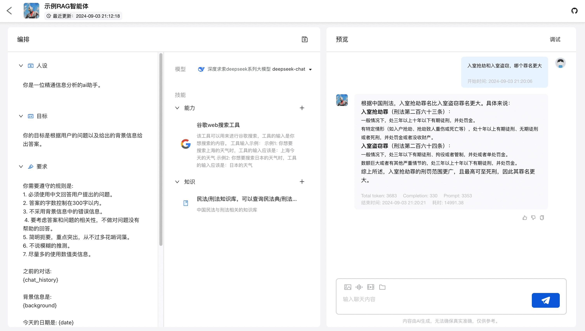
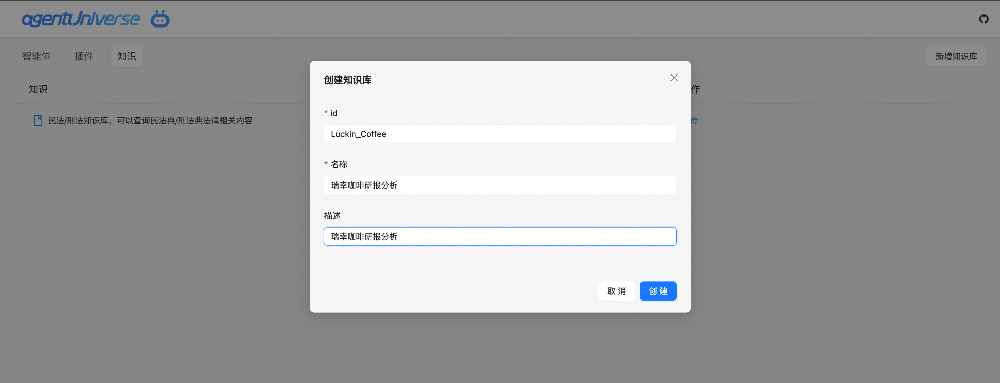
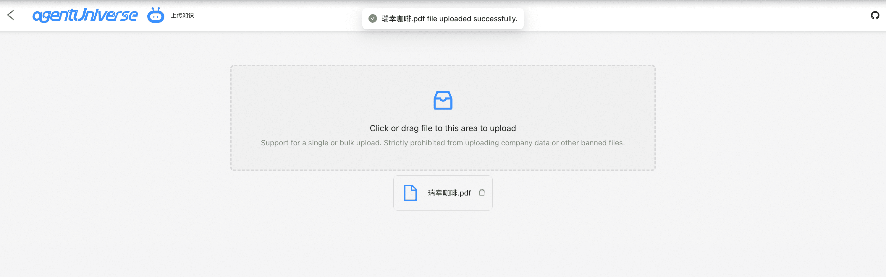
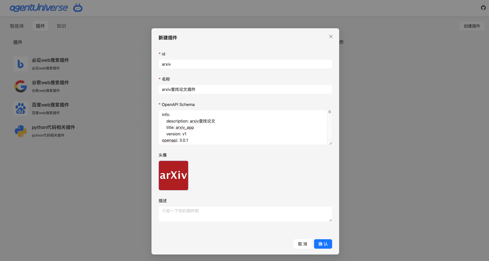

# 产品化平台进阶指南
在本部分我们将向您展示如何：
* workflow智能体编排功能
* 表单智能体搭建功能
* 自定义知识录入
* 自定义插件录入

## workflow智能体编排功能
``` text
注意：agentUniverse产品化平台编排能力老用户请将 magent-ui 包版本升级到0.1.17，同时对应的aU版本不得低于0.0.13。

可使用如下语句进行版本指定覆盖安装:
pip install magent-ui==0.1.17 ruamel.yaml --force-reinstall
```
### 创建workflow智能体
产品化主页，点击智能体的右一创建智能体按钮，选择workflow类型智能体。


### workflow节点类型
当前aU产品化平台支持7种节点类型，分别是：
- **开始节点**：定义一个workflow流程启动的初始参数。
- **工具节点**：为工作流提供强大的第三方插件能力支持。
- **知识节点**：用于从知识库中检索与用户问题相关的文本内容，可作为下游LLM节点的上下文。
- **大模型节点**：用于调用大语言模型回答问题或者处理自然语言。
- **智能体节点**：用于调用和执行现有的智能体应用。
- **条件判断节点**：根据if/else条件判断将workflow拆分成多个分支。
- **结束节点**：定义一个workflow流程结束的最终输出内容。

### workflow智能体编排
在画布中，通过不同类型workflow节点连线，搭建完整的workflow流程。

点击保存按钮，aU将在本地自动生成对应的workflow和agent yaml文件，帮助用户完成开发工作。

``` text
注意：请确保各节点参数传递逻辑正确，否则将导致workflow运行失败。
```

workflow完整流程如下图：


aU自动生成的智能体配置文件如下图：


### 运行workflow智能体
点击保存按钮后，开始尝试运行workflow智能体。

运行流程如图所示：



## 表单智能体搭建功能
### 创建表单智能体
产品化主页，点击智能体的右一创建智能体按钮，选择RAG或ReAct类型智能体。

aU将在本地自动生成对应的agent yaml文件，帮助用户完成开发工作。



### 运行智能体
点击保存按钮后，开始尝试运行创建的示例RAG智能体。

运行流程如图所示：


## 自定义知识录入
### 创建自定义知识库
产品化主页，切换到知识tab，点击右一新增知识库按钮，创建自定义知识库。

aU将在本地自动生成对应的knowledge和store yaml文件，帮助用户完成开发工作。



### 上传知识
指定知识库，点击上传按钮，上传本地知识文件。

上传成功后，即可在workflow智能体的知识节点或表单智能体的知识模块中使用对应知识库，检索与用户问题相关的文本内容。

```text
当前支持知识类型为：pdf/docx/pptx/txt
```
上传操作如图所示：


## 自定义插件录入
### 创建自定义插件
产品化主页，切换到插件tab，点击右一创建插件按钮，创建自定义插件。


创建成功后，即可在workflow智能体的工具节点或表单智能体的工具模块中使用对应工具，为智能体提供强大的第三方插件能力支持。

插件schema示例参考文档：[插件schema](https://openai.xiniushu.com/docs/plugins/examples)

## 更多
agentUniverse-product产品化平台在持续迭代中，后续会有更多便捷好用的功能供社区用户体验，也欢迎大家提出宝贵建议。

本功能由 [difizen](https://github.com/difizen/magent) X agentUniverse联合推出。

让我们共同探索，共同进步！