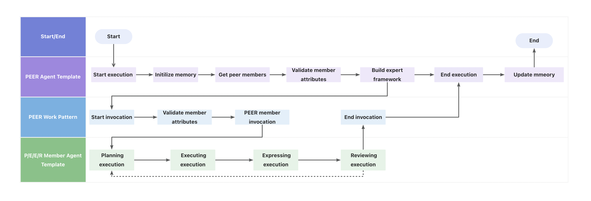

# 工作模版(Work Pattern)

工作模式包含了典型的单智能体和多智能体间的工作协同范式，典型的工作模式包括PEER/DOE等。

## 如何定义工作模式

### [工作模式基础类定义](../../../../../../agentuniverse/agent/work_pattern/work_pattern.py)

包含配置信息如下：

- name: 工作模式名称
- description: 工作模式描述

包含方法如下：

- invoke(self, input_object: InputObject, work_pattern_input: dict, **kwargs) -> dict:
  : 工作模式同步执行方法（抽象方法）

- async_invoke(self, input_object: InputObject, work_pattern_input: dict, **kwargs) -> dict:
  : 工作模式异步执行方法（抽象方法）

### 工作模式具体实现类的定义

以agentUniverse内置的[PEER工作模式](../../../../../../agentuniverse/agent/work_pattern/peer_work_pattern.py)为例，定义了四个属性：

- planning: plan拆解节点
- executing: execute执行节点
- expressing: express表达节点
- reviewing: review评价节点

invoke和async_invoke分别为工作模式的同步和异步执行方法。工作模式执行逻辑**只包含各节点间的流转逻辑，相比于智能体模版，可以理解为更高层级的系统抽象**。

## 如何使用工作模式
以上文提及的PEER工作模式为例，其调用关系存在于[PEER智能体模版](../../../../../../agentuniverse/agent/template/peer_agent_template.py)中，
在智能体模版的执行逻辑中，获取指定工作模式实例，装配属性并执行。

流程图如下：


通过调用peer智能体模版对应的智能体实例，开启整体流程；peer智能体模版在做好前置校验工作后，调用工作模式，工作模式执行各节点成员间的流转逻辑，最终将结果返回给peer智能体模版，进行具体的拼装、后置处理等，最终结束整体流程。

## 使用WorkPattern工作模式管理器

通过WorkPatternManager中的`get_instance_obj(xx_work_pattern)` 方法可以获取对应名称的工作模式实例。

```python
from agentuniverse.agent.work_pattern.work_pattern_manager import WorkPatternManager

work_pattern_name = 'xxx_work_pattern'
work_pattern = WorkPatternManager().get_instance_obj(component_instance_name=work_pattern_name)
```

## agentUniverse目前内置有以下工作模式:

### [PeerWorkPattern](../../../../../../agentuniverse/agent/work_pattern/peer_work_pattern.py)

内置系统配置如下：

```yaml
name: 'peer_work_pattern'
description: 'peer work pattern'
metadata:
  type: 'WORK_PATTERN'
  module: 'agentuniverse.agent.work_pattern.peer_work_pattern'
  class: 'PeerWorkPattern'
```
用户可通过工作模式管理器获取Peer工作模式系统实例。

## 工作模式/智能体模版 vs 智能体计划
- 智能体模版把具体编排逻辑封装在execute方法中，可类比之前的智能体计划（planner）执行逻辑。
- 智能体模版抽象智能体的执行逻辑，使用者可根据不同配置信息装配模版为不同的智能体实例，重复使用。
- 工作模式为智能体模版的更上层级抽象，包含典型的单智能体和多智能体间的工作协同范式，invoke方法中只包含各节点间的流转逻辑，不包含具体的业务处理逻辑。

# 总结
至此您已了解工作模式的作用，工作模式的具体定义以及如何使用工作模式。