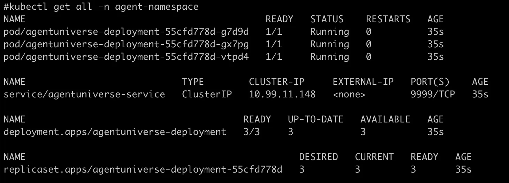
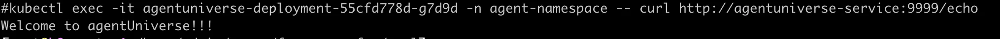
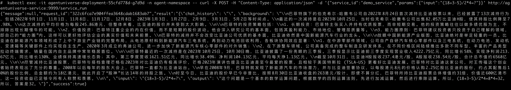

# K8S集群部署
AgentUniverse 提供标准的工作环境镜像，并且支持在 Kubernetes (K8S) 集群上容器化部署。本指南将指导您如何利用这些工作环境镜像，在 K8S 上部署和搭建集群。镜像tag列表您可以在[这里获取](https://cr.console.aliyun.com/repository/cn-hangzhou/agent_universe/agent_universe/images)。

官方K8S使用文档：[Kubernetes Setup Documentation](https://kubernetes.io/docs/setup/)

## 1. 资源配置

首先，您需要配置必要的资源文件。以下是使用 YAML 配置文件定义所需的 Namespace、Deployment 和 Service 资源的示例：

```yaml
apiVersion: v1
kind: Namespace
metadata:
  name: agent-namespace
---
apiVersion: apps/v1
kind: Deployment
metadata:
  name: agentuniverse-deployment
  namespace: agent-namespace
  labels:
    app: agentuniverse
spec:
  replicas: 3
  selector:
    matchLabels:
      app: agentuniverse
  template:
    metadata:
      labels:
        app: agentuniverse
    spec:
      containers:
      - name: agentuniverse-container
        image: registry.cn-hangzhou.aliyuncs.com/agent_universe/agent_universe:0.0.9_centos8
        ports:
        - containerPort: 8888
        command: ["/bin/bash", "-c"]
        args: ["git clone git@github.com:antgroup/agentUniverse.git; mv agentUniverse/sample_standard_app /usr/local/etc/workspace/project; /bin/bash --login /usr/local/etc/workspace/shell/start.sh"]
        # Uncomment and replace "XXX" with your key to configure the agent
        # env:
        # - name: OPENAI_API_KEY
        #   value: "XXX"
---
apiVersion: v1
kind: Service
metadata:
  name: agentuniverse-service
  namespace: agent-namespace
spec:
  selector:
    app: agentuniverse
  ports:
  - protocol: TCP
    port: 9999
    targetPort: 8888
```

### 1.1 AgentUniverse项目环境变量设置

#### 方式1（推荐）

在资源配置文件中，取消注释env部分，并将`value`替换为您的密钥。对于进一步的安全性要求，推荐使用K8S官方推荐的方式，比如ConfigMap。参考 [ConfigMap Configuration Documentation](https://kubernetes.io/docs/tasks/configure-pod-container/configure-pod-configmap/)。

#### 方式2

请参考配置文件开始部分的描述: [快速开始指南](../../../开始使用/快速开始.md)

## 2. 构建资源

创建并应用上述配置文件：

```
kubectl apply -f agentuniverse.yaml
```

## 3. 验证资源

确认所有资源是否正确部署：

```
kubectl get all -n agent-namespace
```

## 4. 从集群内部访问AgentUniverse 服务

要从集群内部访问 AgentUniverse 服务，请使用以下命令行示例：

```
kubectl exec -it [Pod名称] -n agent-namespace -- curl http://agentuniverse-service:9999
```

### 4.1 示例

#### 4.1.1 联通性测试

```
kubectl exec -it agentuniverse-deployment-55cfd778d-g7d9d -n agent-namespace -- curl http://agentuniverse-service:9999/echo
```


#### 4.1.2 问答测试

```
kubectl exec -it agentuniverse-deployment-55cfd778d-g7d9d -n agent-namespace -- curl -X POST -H "Content-Type: application/json" -d '{"service_id":"demo_service","params":{"input":"(18+3-5)/2*4=?"}}' http://agentuniverse-service:9999/service_run
```

