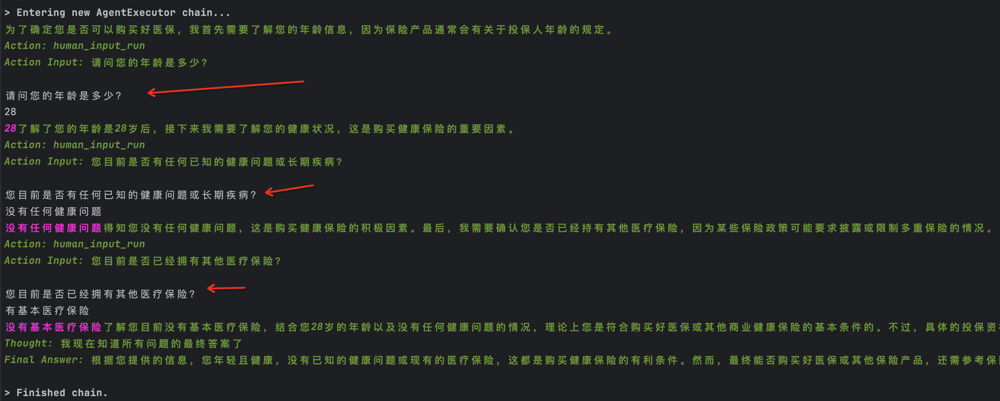

# rag chat bot 快速开始
为了帮助大家快速体验aU,我们提供了一个rag chat bot的快速开始的教程。

## 1. 环境准备
使用 git clone aU 项目,并进入到样例工程目录
```shell
git clone https://github.com/alipay/agentUniverse.git
cd agentUniverse/sample_standard_app
```
### 1.1 无有效Python环境
对于 Mac & Linux 系统, 可以直接使用提供的脚本quick_start.sh安装python环境,脚本会自动安装python环境与依赖包。
```shell
bash quick_start.sh
```

对于 Windows 系统, 可以使用 quick_start.bat 安装一个python环境。
```shell
quick_start.bat
```
运行成功后，会启动一个服务，服务地址为：http://127.0.0.1:8080/

### 1.2 已有python环境
注意：如果你已经有了一个有效的python环境，且python 版本大于3.10，可以直接安装agentuniverse依赖。
#### 1.2.1 针对Mac & Linux 系统
运行命令
```shell
pip install agentuniverse==0.0.12
export PYTHONPATH=$PWD/../..
cd app/bootstrap
python -u bootstrap.py
```

#### 1.2.2对于 Windows 系统
运行命令
```shell
pip install agentuniverse==0.0.12
set PYTHONPATH=%CD%\..\..\..\..\
python -u bootstrap.py
```

### 1.3 vscode 配置
如果想要使用vscode进行调试，请先使用vscode打开au项目，安装python插件，创建一个名为.vscode的文件夹，并在文件夹下创建一个名为launch.json的文件，内容如下：
```json
{
    "version": "0.2.0",
    "configurations": [
        {
            "name": "Python 调试程序: 当前文件",
            "type": "debugpy",
            "request": "launch",
            "program": "${file}",
            "cwd": "${fileDirname}",
            "justMyCode": true,
            "subProcess": true,
            "python": "${command:python.interpreterPath}",
            "env":{
                 "PYTHONPATH": "${workspaceFolder}"
            },
            "purpose": [
					"debug-test"
			]
        }
    ]
}
```
使用命令command + shift + P命令或者打开一个py文件，右下角选择你想要使用的python环境。在vscode的终端当中激活python环境，并在vscode的命令行当中安装依赖：
```shell
pip install agentuniverse==0.0.12
```  
最后，使用vscode调试，打开sample_standard_app/app/bootstrap/server_application.py,点击右上角中的调试按钮，即可进行启动进行调试。

### 1.4 Pycharm 配置
如果使用pycharm，请使用Pycharm打开agentUniverse项目，点击右上角选择Python解释器，选择你想使用的python环境。选择好python环境之后，在terminal中运行命令：
```shell
pip install agentuniverse==0.0.12
```
命令执行完成之后，双击打开sample_standard_app/app/bootstrap/server_application.py，点击右上角中的调试或者运行按钮，即可进行启动进行调试。

## 2. 项目配置
复制一份config目录custom_key.toml.sample下的配置模板，重命名为custom_key.yaml

```shell
cp config/config.yaml config/custom_key.yaml
```

配置文件在config.yaml中，将`#custom_key_path = './custom_key.toml'` 的注释删除,配置结果如下:   
```toml
[SUB_CONFIG_PATH]
# Log config file path, an absolute path or a relative path based on the dir where the current config file is located.
log_config_path = './log_config.toml'
# Custom key file path, use to save your own secret key like open ai or sth else. REMEMBER TO ADD IT TO .gitignore.
custom_key_path = './custom_key.toml'
```
注意: 你已经使用过 quick_start.sh 脚本安装python环境,这里可以直接跳过

## 3. 运行案例
当前运行案例是基于千问大模型，在使用案例之前，必须在config/custom_key.toml中配置好DASHSCOPE_API_KEY：
```toml
DASHSCOPE_API_KEY='sk-*****'
```
key的获取方式请参考：[千问](https://dashscope.console.aliyun.com/apiKey)  
进入到案例目录,对于 Mac & Linux 系统，运行如下命令：

```shell
source ~/.bashrc
cd app/examples
bash run_rag_chat_bot.sh
```
或者

```shell
cd app/examples
export PYTHONPATH=$PWD/../../../..
python react_chat_bot.py
```

对于 Windows 系统，运行如下命令：
```shell
cd app/examples
set PYTHONPATH=%CD%\..\..\..\..\
run_rag_chat_bot.bat
```

在 vscode或者pycharm中可以直接通过打开想要运行的文件，点击右上角中的调试或者运行按钮，即可进行启动进行调试。

## 4.为agent添加工具
当前bot当中已经配置了一个google工具，可以通过修改agent配置来修改或添加工具。针对当前的ragchatbot所绑定的agent，修改agent配置文件config/agent_config.yaml,  
将agent_id修改为`react_chat_bot`，其配置文件为：agentUniverse/sample_standard_app/app/core/agent/react_agent_case/demo_react_agent.yaml，新增一个human_input_run工具,可以让模型询问用户问题。
```yaml
info:
  name: 'demo_react_agent'
  description: 'react agent'
profile:
  prompt_version: qwen_react_agent.cn
  llm_model:
    name: 'qwen_llm'
    model_name: 'qwen-max'
    stop: 'Observation'
    temperature: 0.1
action:
  tool:
    - 'google_search_tool'
    - 'python_runner'
    - 'human_input_run'
  knowledge:
    - 'civil_law_knowledge'
    - 'criminal_law_knowledge'
  agent:
    - 'law_rag_agent'
plan:
  planner:
    name: 'react_planner'
metadata:
  type: 'AGENT'
  module: 'agentuniverse.agent.default.react_agent.react_agent'
  class: 'ReActAgent'
```
重新测试，修改问题为： 我想知道我的公历生日对应的阳历生日是哪一天？
```shell
cd app/examples
export PYTHONPATH=$PWD/../../../..
python react_chat_bot.py --question "我可以购买好医保么，你可以询问我的健康状况，但是每次只能询问一个问题"
```

