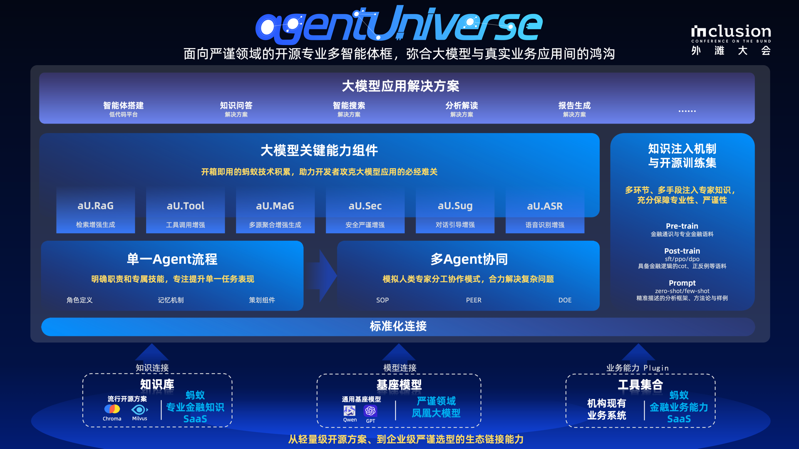

# 为什么选择agentUniverse
agentUniverse是一个多智能体框架，面向实际业务场景中的复杂任务优化设计。agentUniverse不仅提供搭建单一智能体的全部关键组件，还提供了多智能体之间协作模式的编排组件（类似于Pattern Factory），开发者可以通过自定义协同模式，让智能体各司其职，更好的解决自己领域的专业问题。同时，agentUniverse提供专家经验的注入机制，帮助开发者和企业轻松构建具备专业KnowHow的智能应用。

## 架构大图

agentUniverse基础能力包含单Agent能力，提供多智能体协同模式编排组件，同时给开发者提供知识注入的手段与机制。

在这之中通过框架标准化连接，用户可以将任意自有的模型、知识与工具接入框架中供不同的智能体使用。

通过上述能力您可以构建出专属的智能应用。框架将进一步提供大模型应用关键能力组件与应用解决方案，其中大模型应用关键能力组件将针对大模型应用难点，如RAG、工具调用、安全严谨等方向提供开箱即用的增强能力帮助开发者克服必经难关；应用解决方案将针对知识问答、智能搜索、分析解读等大模型应用典型场景提供端到端解决方案以提升应用构建效率。

## 核心特性
通过上述的介绍我们将其归纳总结，agentUniverse包含如下特点：

* **丰富的多智能体协同模式：** 提供PEER（Plan/Execute/Express/Review）、DOE（Data-fining/Opinion-inject/Express）等产业中验证有效的协同模式，同时支持用户自定义编排新模式，让多个智能体有机合作；

* **所有组件均可定制：** LLM、知识、工具、记忆等所有框架组件均提供自定义能力，供用户来增强专属智能体；

* **轻松融入领域经验：** 提供领域prompt、知识构建与管理的能力，同时支持领域级SOP编排与注入，将智能体对齐至领域专家级别；

💡 更多特点见[agentUniverse核心特性](核心特性.md)部分。